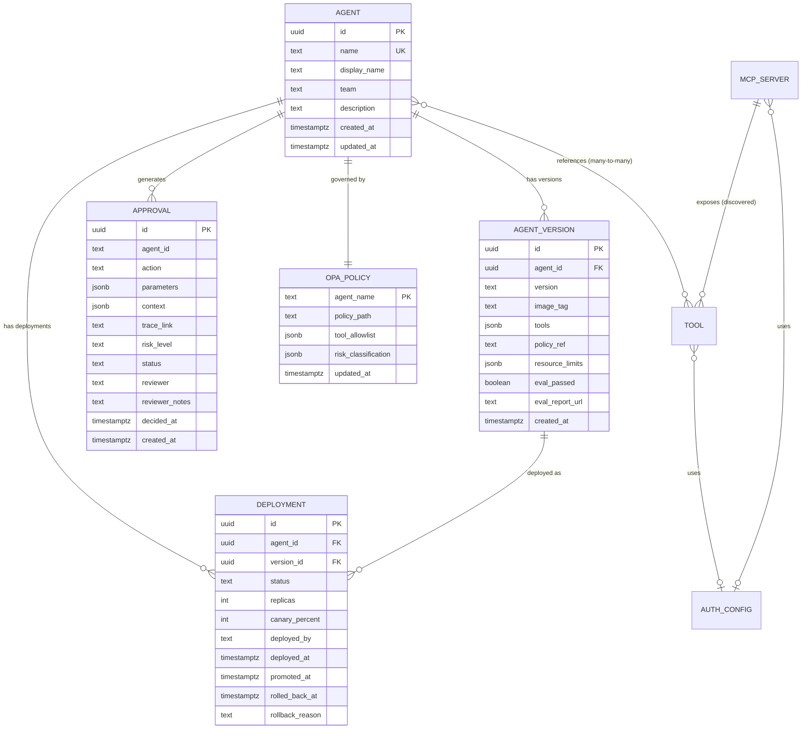

# AgentShield — Product Requirements Document

A self-hosted AI Agent Safety & Governance Platform deployed on Kubernetes.

---

## 1. Product Overview

### Vision

A single platform that lets engineering teams deploy, govern, and observe AI agents with confidence — enforcing safety guardrails, human approval gates, and policy controls without requiring external SaaS dependencies.

### Problem Statement

Without AgentShield, teams deploying AI agents face:
- No consistent safety enforcement — each agent team rolls their own guardrails (or skips them)
- No visibility into what agents are doing — tool calls, costs, and failures are invisible
- No governance over high-risk actions — agents can delete data or send emails without oversight
- No standard deployment path — agents are deployed ad hoc with inconsistent configs
- No way to prove compliance — auditors can't see what was approved, by whom, or why

### Constraints

- **100% self-hosted** on Kubernetes — zero SaaS dependencies
- Uses the verified tool stack from [[2026-06-24-ai-safety-governance-architecture]]
- Agent-per-Pod deployment model
- Shared Postgres for state management

---

## 2. Personas

| Persona | Description | Primary Concern |
|---------|-------------|-----------------|
| **Agent Developer** | Builds agent logic using SDK (declarative or graph mode) | "Let me ship my agent safely without becoming a platform expert" |
| **Citizen Builder** | Product/ops team member who creates agents via visual builder (no code) | "Let me automate a workflow without writing Python" |
| **Platform Engineer** | Operates AgentShield, manages infrastructure | "Keep the platform stable, scalable, and simple to maintain" |
| **Reviewer** | Approves/rejects high-risk agent actions | "Give me enough context to make a fast, confident decision" |
| **Security/Compliance** | Audits policies, runs red-teams, ensures compliance | "Prove to me that no agent can go rogue" |
| **Engineering Leader** | Oversees agent program, manages budgets | "Show me cost, risk, and adoption at a glance" |
| **Tool Owner** | Defines and maintains shared tools used by multiple agents (API integrations, MCP servers) | "Let me define a tool once and have any agent use it safely" |

---

## 3. User Stories

### Agent Developer

| ID | Story | Acceptance Criteria |
|----|-------|-------------------|
| US-D01 | As a developer, I want to create an agent with `Agent(instructions, tools)` (OpenAI-style) so that simple agents need no graph wiring | Agent runs locally with `agentshield dev`, deploys via CI |
| US-D02 | As a developer, I want to reference shared tools from the Tool Registry so that I don't redefine the same HTTP call in every agent | `Agent(tools=["lookup_order", "slack.send_message"])` resolves tool IDs from registry at deploy time |
| US-D03 | As a developer, I want to deploy a new version as a canary so that I can validate before full rollout | 10% traffic routed to canary, metrics visible in Langfuse |
| US-D04 | As a developer, I want to rollback a bad deployment in under 60 seconds so that customers aren't impacted | One-click rollback in UI, previous version live within 60s |
| US-D05 | As a developer, I want to see traces of my agent's runs so that I can debug issues | Full trace visible in Langfuse within 5s of request completion |
| US-D06 | As a developer, I want CI to block my PR if eval scores regress so that quality doesn't degrade | promptfoo runs on PR, fails if assertions break |
| US-D07 | As a developer, I want to configure risk levels per tool so that the right actions route to HITL | Risk levels stored in registry, OPA consumes them |
| US-D08 | As a developer, I want SSE streaming from my agent to frontend apps so that users see real-time responses | `/chat/stream` endpoint emits text_delta, tool_call, approval events |
| US-D09 | As a developer, I want to define multi-agent handoffs so that complex workflows route between specialized agents | `handoffs=[other_agent]` in Agent constructor, handoff governed by safety |
| US-D10 | As a developer, I want to drop down to full LangGraph when I need complex branching so that I'm not limited by the declarative API | `AgentGraph(StateGraph(...))` with same governance as declarative agents |

### Citizen Builder (No-Code)

| ID | Story | Acceptance Criteria |
|----|-------|-------------------|
| US-B01 | As a citizen builder, I want to create an agent by dragging nodes on a canvas so that I don't need to write code | Studio UI allows creating Agent + Tool + Gate nodes visually |
| US-B02 | As a citizen builder, I want to pick tools from a shared registry instead of configuring them manually so that I don't re-enter the same endpoint URLs every time | Tool Picker panel shows all available tools; drag to canvas attaches tool node pre-configured |
| US-B03 | As a citizen builder, I want to add approval gates between steps so that high-risk actions require human review | Approval Gate node configurable with conditions, reviewer team, timeout |
| US-B04 | As a citizen builder, I want to deploy my visual workflow with one click so that it goes live without a CI pipeline | Deploy button creates declarative runner pod from JSON workflow (no container build) |
| US-B05 | As a citizen builder, I want to test my workflow in sandbox mode so that I can validate before deploying | "Test" button runs workflow without side effects, shows simulated trace |
| US-B06 | As a citizen builder, I want to see version history of my workflow so that I can rollback changes | Version list with diff view, one-click restore to previous version |

### Tool Owner

| ID | Story | Acceptance Criteria |
|----|-------|-------------------|
| US-T01 | As a tool owner, I want to create an HTTP tool once and share it with all agents so that I don't maintain per-agent copies | Tool created in registry, any agent references it by ID, same definition across all |
| US-T02 | As a tool owner, I want to register an MCP server so that all its tools become available to agents automatically | Register server URL → AgentShield discovers tools via `tools/list` within 30s |
| US-T03 | As a tool owner, I want to manage tool credentials in one place so that rotating an API key doesn't require touching every agent | AuthConfig referenced by tool; update K8s Secret → all agents pick up new credentials |
| US-T04 | As a tool owner, I want to see which agents use my tool before deprecating it so that I don't break anything | `GET /api/v1/tools/{id}/agents` returns list of agents; UI shows impact count |
| US-T05 | As a tool owner, I want to test a tool from the registry UI so that I know it's working before agents use it | Test button executes tool with sample input, shows response or error |
| US-T06 | As a tool owner, I want tool changes to auto-update OPA policies so that risk levels stay accurate without manual policy edits | Changing tool risk level regenerates OPA policy for all agents that reference it |

### Platform Engineer

| ID | Story | Acceptance Criteria |
|----|-------|-------------------|
| US-P01 | As a platform engineer, I want to deploy AgentShield with Helm so that setup is repeatable | Single `helm install` deploys all components |
| US-P02 | As a platform engineer, I want health checks for every component so that I know when something's broken | `/health` endpoint on all services, Prometheus alerts configured |
| US-P03 | As a platform engineer, I want to scale agent pods independently so that one busy agent doesn't starve others | HPA per agent deployment, independent resource limits |
| US-P04 | As a platform engineer, I want centralized logging so that I can debug cross-component issues | All components emit structured JSON logs to a central collector |
| US-P05 | As a platform engineer, I want to upgrade components independently so that I don't need full-platform downtime | Each component deployed as separate Helm chart or Deployment |

### Reviewer

| ID | Story | Acceptance Criteria |
|----|-------|-------------------|
| US-R01 | As a reviewer, I want to see pending approvals in a queue with full context so that I can decide quickly | Queue shows agent, action, parameters, risk level, trace link |
| US-R02 | As a reviewer, I want to approve or reject with one click so that agents aren't blocked unnecessarily | Single button press, response time <500ms |
| US-R03 | As a reviewer, I want to add notes to my decision so that there's an audit trail | Free-text notes field, stored with the approval record |
| US-R04 | As a reviewer, I want Slack notifications for new approvals so that I don't need to watch the dashboard | Slack webhook fires within 10s of new pending approval |
| US-R05 | As a reviewer, I want timed-out approvals to fail closed so that agents don't hang forever | Configurable timeout (default 30min), auto-reject on expiry |

### Security/Compliance

| ID | Story | Acceptance Criteria |
|----|-------|-------------------|
| US-S01 | As security, I want to see all policy denials in one place so that I can identify attack patterns | Langfuse dashboard shows blocked requests with reasons |
| US-S02 | As security, I want weekly automated red-team scans so that new vulnerabilities are caught early | Garak scheduled run, results in CI artifact + alert on failure |
| US-S03 | As security, I want an audit log of all approvals so that I can prove compliance | Postgres approvals table with immutable history |
| US-S04 | As security, I want to define policies in code so that changes are reviewed via PR | OPA policies in git, CI validates syntax, deployed via bundle |
| US-S05 | As security, I want to block any agent from accessing tools outside its allowlist so that blast radius is contained | OPA denies unlisted tools, deny event logged |

### Engineering Leader

| ID | Story | Acceptance Criteria |
|----|-------|-------------------|
| US-L01 | As a leader, I want to see total LLM cost by agent and team so that I can manage budgets | Langfuse cost dashboard with agent/team grouping |
| US-L02 | As a leader, I want to see how many high-risk actions were approved vs rejected so that I understand risk posture | Approval rate dashboard in Langfuse or Grafana |
| US-L03 | As a leader, I want to see agent adoption metrics so that I know which agents are used | Request volume per agent over time |

---

## 4. Functional Requirements

### 4.1 Agent Lifecycle Management

| ID | Requirement | Priority | Acceptance Criteria |
|----|------------|----------|-------------------|
| FR-001 | Register a new agent with name, team, description, and tool list | P0 | Agent stored in registry, visible in UI within 30s |
| FR-002 | Define tool permissions and risk classification per agent | P0 | Each tool has a risk level (low/medium/high), stored in registry |
| FR-003 | Upload a new agent version with image tag and changelog | P0 | Version linked to agent, image tag validated against container registry |
| FR-004 | Mark a version as eval-passed via CI webhook | P0 | Only eval-passed versions can be deployed |
| FR-005 | Deploy a version to production (full rollout) | P0 | K8s Deployment created/updated within 60s |
| FR-006 | Deploy a version as canary with configurable traffic percentage | P1 | Canary Deployment created, traffic split configured |
| FR-007 | Promote canary to full deployment | P1 | Old version replaced, canary removed |
| FR-008 | Rollback to previous version | P0 | Previous image tag restored within 60s |
| FR-009 | Stop/decommission an agent | P1 | K8s Deployment scaled to 0 or deleted |
| FR-010 | View deployment history per agent | P1 | Chronological list: who deployed what, when, outcome |

### 4.2 Safety & Guardrails

| ID | Requirement | Priority | Acceptance Criteria |
|----|------------|----------|-------------------|
| FR-011 | Scan all inputs for prompt injection before reaching agent | P0 | LLM Guard DeBERTa model scores every input, blocks above threshold |
| FR-012 | Scan all inputs for PII and anonymize before LLM processing | P0 | Presidio detects and redacts PII, mapping stored for de-anonymization |
| FR-013 | Scan all outputs for PII leakage before returning to user | P0 | Output passes through LLM Guard + Presidio output scanner |
| FR-014 | Apply YARA-based injection detection rules | P0 | NeMo YARA rules catch SQL/XSS/Jinja/Python injection patterns |
| FR-015 | Block requests that exceed confidence threshold | P0 | Blocked requests return error to user, logged to Langfuse |
| FR-016 | Support chunked scanning for inputs >512 tokens | P1 | Long inputs split and each chunk scanned independently |
| FR-017 | Fact-check agent outputs using AlignScore | P2 | AlignScore runs on responses where grounding docs are available |
| FR-018 | Support custom banned word/phrase lists per agent | P1 | BanSubstrings scanner configurable per agent via registry |
| FR-019 | Detect and block secrets (API keys, tokens) in inputs/outputs | P0 | Secrets scanner catches AWS keys, JWTs, private keys |

### 4.3 Policy & Governance

| ID | Requirement | Priority | Acceptance Criteria |
|----|------------|----------|-------------------|
| FR-020 | Evaluate policy before every tool call | P0 | OPA sidecar returns allow/deny within 5ms |
| FR-021 | Classify tool call risk level (low/medium/high) | P0 | Risk level determined from registry config, passed to OPA |
| FR-022 | Deny tool calls not in agent's allowlist | P0 | Unlisted tools always denied, event logged |
| FR-023 | Support parameter-level constraints (e.g., max refund amount) | P1 | Rego policies validate parameter values |
| FR-024 | Support time-based constraints (e.g., no deletes outside business hours) | P2 | Rego policies reference current time |
| FR-025 | Audit log every policy decision | P0 | OPA decision logs stored (allow/deny, input, timestamp) |
| FR-026 | Policy changes require PR review before deployment | P1 | OPA policies in git, CI validates, bundle deployed on merge |

### 4.4 Human-in-the-Loop

| ID | Requirement | Priority | Acceptance Criteria |
|----|------------|----------|-------------------|
| FR-027 | Route high-risk actions to approval queue | P0 | Agent pauses (interrupt), approval record created in Postgres |
| FR-028 | Display approval queue with full context | P0 | Appsmith shows: agent, action, params, risk, trace link |
| FR-029 | One-click approve/reject with optional notes | P0 | Status updated in DB, agent resumes within 5s of decision |
| FR-030 | Configurable timeout with fail-closed behavior | P0 | Default 30min, auto-reject on timeout, agent resumes with denial |
| FR-031 | Slack notification on new pending approval | P1 | Webhook fires within 10s, message includes action summary |
| FR-032 | Support reviewer assignment (route to specific team) | P2 | Approvals tagged with team, UI filters by assigned team |
| FR-033 | Immutable audit trail of all decisions | P0 | Approval records cannot be updated after decided (append-only pattern) |

### 4.5 Observability & Tracing

| ID | Requirement | Priority | Acceptance Criteria |
|----|------------|----------|-------------------|
| FR-034 | Capture full trace for every agent request | P0 | Trace in Langfuse: all LLM calls, tool calls, safety scans, approvals |
| FR-035 | Track cost per request (tokens, dollars) | P0 | Cost visible in trace, aggregatable by agent/team/model |
| FR-036 | Track latency per span (safety, LLM, tool, HITL) | P0 | Span durations visible in trace, p50/p95/p99 in dashboard |
| FR-037 | Dashboard: cost by agent over time | P1 | Langfuse dashboard configured and accessible |
| FR-038 | Dashboard: safety block rate over time | P1 | Shows injection blocks, PII redactions, policy denials per day |
| FR-039 | Dashboard: HITL approval rate and latency | P1 | Shows: approval %, avg wait time, timeout rate |
| FR-040 | Alert on error rate spike | P1 | Prometheus alert fires when agent error rate > 5% for 5min |
| FR-041 | Alert on cost spike | P2 | Alert when daily cost exceeds 2x 7-day average |

### 4.6 Evaluation & Testing

| ID | Requirement | Priority | Acceptance Criteria |
|----|------------|----------|-------------------|
| FR-042 | Run eval suite on every PR that touches agent code | P0 | promptfoo runs in CI, PR blocked if assertions fail |
| FR-043 | Run red-team probes on PR | P1 | promptfoo red-team plugin included in eval config |
| FR-044 | Weekly Garak vulnerability scan | P1 | Scheduled CI job, results stored, alert on new vulnerabilities |
| FR-045 | Push eval scores to Langfuse for trend tracking | P1 | Scores visible in Langfuse, trend dashboard shows regression |
| FR-046 | Post-hoc annotation queue for sampled outputs | P2 | Langfuse annotation queue configured, reviewers score weekly |
| FR-047 | LLM-as-Judge automated scoring on all traces | P2 | Langfuse evaluator runs asynchronously, scores stored on trace |

### 4.7 Agent SDK

| ID | Requirement | Priority | Acceptance Criteria |
|----|------------|----------|-------------------|
| FR-062 | Declarative Agent API: `Agent(name, instructions, tools, model)` | P0 | Agent runs with single constructor, no graph code needed |
| FR-063 | Tool decorator: `@tool(risk="low\|high")` with auto OPA + HITL integration | P0 | Risk level propagates to OPA policy and HITL gate automatically |
| FR-064 | Runner: `Runner.run(agent, input)` for sync execution | P0 | Returns final output after full execution chain |
| FR-065 | Runner: `Runner.run_streamed(agent, input)` for SSE streaming | P0 | Emits text_delta, tool_call_start/end, approval_requested/decided, done events |
| FR-066 | Multi-agent handoffs: `handoffs=[other_agent]` | P1 | Agent can transfer control, receiving agent gets full safety scan |
| FR-067 | Input/Output guardrails: `@InputGuardrail` / `@OutputGuardrail` decorators | P1 | Custom business rules run in addition to platform safety scanners |
| FR-068 | Context injection: `context=MyContext(...)` shared across tools | P1 | Context available in all tool functions without global state |
| FR-069 | Local dev server: `agentshield dev` with mock safety layer + hot reload | P0 | Developer iterates locally, sees simulated approval flow in CLI |
| FR-070 | Escape hatch: `AgentGraph(StateGraph(...))` for full LangGraph control | P0 | Complex agents get same governance as declarative agents |
| FR-071 | Agent scaffolding: `agentshield init <name> --template=<type>` | P1 | Generates agent.yaml, graph.py, tools/, policies/, Dockerfile, tests/ |

### 4.8 SSE Streaming Protocol

| ID | Requirement | Priority | Acceptance Criteria |
|----|------------|----------|-------------------|
| FR-072 | `text_delta` event for incremental text streaming | P0 | Frontend receives tokens as they're generated |
| FR-073 | `tool_call_start` / `tool_call_end` events for tool execution visibility | P0 | Frontend can show tool execution progress |
| FR-074 | `approval_requested` event when HITL gate triggers | P0 | Frontend can show "waiting for approval" state |
| FR-075 | `approval_decided` event when reviewer acts | P0 | Frontend can resume showing agent progress |
| FR-076 | `done` event with token usage metadata | P0 | Frontend knows stream is complete, can show cost |
| FR-077 | Compatible with Vercel AI SDK `useChat()` hook | P1 | Standard React hook works out of the box |
| FR-078 | Compatible with CopilotKit streaming adapter | P1 | CopilotKit adapter consumes events without custom code |

### 4.9 Visual Agent Builder (AgentShield Studio)

| ID | Requirement | Priority | Acceptance Criteria |
|----|------------|----------|-------------------|
| FR-079 | Drag-and-drop canvas with Agent, Tool, Approval Gate, Router, End nodes | P1 | User can compose multi-step workflows visually |
| FR-080 | Agent node: configurable instructions, model selection, tool assignment | P1 | Properties panel updates node config on save |
| FR-081 | HTTP Tool node: method, URL, headers, body template with `{{variable}}` syntax | P1 | Tool executes HTTP call with templated variables at runtime |
| FR-082 | Approval Gate node: condition, reviewer team, timeout, context display options | P1 | Same HITL flow as SDK-built agents |
| FR-083 | Router node: conditional branching on context values (if/else) | P1 | Edges labeled with conditions, evaluated at runtime |
| FR-084 | Workflow serialization to JSON + storage via Registry API | P1 | Save/load round-trips without data loss |
| FR-085 | One-click deploy to declarative runner pod (no container build) | P1 | Workflow live within 90s of clicking Deploy |
| FR-086 | Sandbox test mode (run without side effects) | P1 | Test shows simulated trace, no real tool calls |
| FR-087 | Version history with diff view | P2 | User can see what changed between versions |
| FR-088 | Workflow templates gallery (common patterns) | P2 | Pre-built templates for FAQ bot, approval workflow, data lookup |

### 4.10 Tool & MCP Registry

| ID | Requirement | Priority | Acceptance Criteria |
|----|------------|----------|-------------------|
| FR-089 | Create a named tool definition with type (native / http / mcp_tool), input schema, output schema, and risk level | P0 | Tool stored in registry, visible in tool picker within 30s |
| FR-090 | Attach and detach tools from agents; OPA policy auto-regenerates on every binding change | P0 | Policy bundle updated and re-pushed to OPA sidecar within 60s of binding change |
| FR-091 | HTTP tool type: configure method, URL, headers, body template with `{{variable}}` syntax | P0 | Tool executes HTTP request at runtime with schema-validated inputs |
| FR-092 | Auth config: store credential type (api_key, oauth2, bearer, mtls) referencing a K8s Secret — never the credential value | P0 | Tool config contains only `auth_config_id`; secret resolved at call time from K8s |
| FR-093 | Test button: execute a tool definition in sandbox mode with sample inputs, show response or error | P0 | Response visible in UI within 10s, sandbox does not write production data |
| FR-094 | Tool usage listing: see all agents currently referencing a given tool | P1 | `GET /api/v1/tools/{id}/agents` returns complete list; shown in UI before deprecation |
| FR-095 | Tool deprecation: soft-delete with impact warning if agents reference the tool | P1 | Warning shows count of affected agents; deprecate blocked unless all bindings removed or force flag used |
| FR-096 | Tool versioning: updating a tool definition creates a new semver version; agents reference a specific version or `latest` | P1 | Previous version still served to pinned agents; rollback by switching version reference |
| FR-097 | Register an MCP server by URL and transport type (streamable_http / stdio); AgentShield auto-discovers tools via `tools/list` | P1 | Discovered tools appear in Tool Registry within 30s of registration |
| FR-098 | Subscribe to `notifications/tools/list_changed` on registered MCP servers; auto-sync when tool list changes | P1 | New tool available in registry within 60s of server-side addition |
| FR-099 | MCP tool invocation: proxy call through AgentShield MCP client, inject auth headers from auth config | P1 | Agent calls tool by registry ID; platform resolves to `tools/call` on correct MCP server |
| FR-100 | Tool picker in Studio: browse registry by type / category / team; drag selected tool onto canvas pre-configured | P1 | Tool node populates with name, schema, risk level from registry; no manual URL entry for known tools |
| FR-101 | SDK resolves tool IDs from registry at agent startup: `Agent(tools=["tool-id-1", "tool-id-2"])` | P1 | Agent fetches tool schemas at init; fails fast if tool ID not found or agent not authorized |
| FR-102 | Auth config rotation: update K8s Secret reference in auth config; all tools referencing it pick up new credentials without redeployment | P2 | Secret reference swapped; next tool invocation uses new credential |

### 4.11 Agent Registry UI

| ID | Requirement | Priority | Acceptance Criteria |
|----|------------|----------|-------------------|
| FR-048 | List all registered agents with status | P0 | Table: name, team, status (live/canary/stopped), current version |
| FR-049 | Agent detail view: config, tools, policies, history | P0 | Single page showing all agent metadata |
| FR-050 | Create/edit agent form | P0 | Form with validation, saves to registry DB |
| FR-051 | Version list with eval status and deploy buttons | P0 | Shows versions, which passed eval, one-click deploy |
| FR-052 | Deploy button with canary percentage selector | P1 | Dropdown: 0% (full), 10%, 25%, 50% canary |
| FR-053 | Promote/rollback buttons on active deployments | P0 | Buttons visible only on canary/live deployments |
| FR-054 | Deployment history timeline | P1 | Visual history of deploys, rollbacks, promotions |

### 4.8 Approval Dashboard UI

| ID | Requirement | Priority | Acceptance Criteria |
|----|------------|----------|-------------------|
| FR-055 | Pending approval queue (sorted by creation time) | P0 | Newest at top or configurable sort |
| FR-056 | Approval card with: agent, action, params, risk, context | P0 | All fields visible without expanding |
| FR-057 | One-click approve/reject buttons | P0 | Single click updates DB, shows confirmation |
| FR-058 | Notes input field | P0 | Free text, stored with decision |
| FR-059 | Link to Langfuse trace | P0 | Clickable link opens trace in new tab |
| FR-060 | Filter by agent, risk level, team | P1 | Dropdown filters, persisted in URL params |
| FR-061 | Historical decisions view (completed approvals) | P1 | Searchable table of past decisions |

---

## 5. Non-Functional Requirements

### 5.1 Performance

| ID | Requirement | Target |
|----|------------|--------|
| NFR-001 | Gateway latency overhead | <5ms p99 |
| NFR-002 | Input safety scan latency | <200ms p99 |
| NFR-003 | OPA policy evaluation | <5ms p99 |
| NFR-004 | Output safety scan latency | <150ms p99 |
| NFR-005 | End-to-end latency (low-risk request, no HITL) | <3s p95 (excluding LLM provider time) |
| NFR-006 | Trace ingestion lag | <10s from request completion to visible in Langfuse |
| NFR-007 | Registry UI page load | <2s |
| NFR-008 | Approval queue refresh | <3s (10s polling interval) |

### 5.2 Scalability

| ID | Requirement | Target |
|----|------------|--------|
| NFR-009 | Concurrent agents supported | 50+ distinct agents |
| NFR-010 | Concurrent requests per agent | 100 req/s per agent (horizontal scaling) |
| NFR-011 | Total platform throughput | 5,000 req/s aggregate |
| NFR-012 | Trace storage retention | 90 days minimum |
| NFR-013 | Approval records retention | Indefinite (compliance requirement) |
| NFR-014 | Pending approvals queue depth | 500+ simultaneous pending without degradation |

### 5.3 Reliability

| ID | Requirement | Target |
|----|------------|--------|
| NFR-015 | Platform availability | 99.9% (excluding planned maintenance) |
| NFR-016 | Zero data loss on pod restart | Agent state checkpointed to Postgres |
| NFR-017 | Graceful degradation if safety scanner fails | Fail-closed (block request), alert platform team |
| NFR-018 | Agent isolation | One agent failure does not affect others |
| NFR-019 | Deployment rollback time | <60s from decision to live |

### 5.4 Security

| ID | Requirement | Target |
|----|------------|--------|
| NFR-020 | All inter-service communication encrypted | mTLS via service mesh or TLS termination |
| NFR-021 | Secrets management | K8s Secrets or external vault (no plaintext in config) |
| NFR-022 | Network policies | Agent pods can only reach their declared tools |
| NFR-023 | Least privilege RBAC | Each component has minimal K8s permissions |
| NFR-024 | PII encryption at rest | PII mapping table encrypted, Postgres TDE or column-level |
| NFR-025 | Audit trail immutability | Approval decisions cannot be modified after creation |

### 5.5 Operability

| ID | Requirement | Target |
|----|------------|--------|
| NFR-026 | Deployment method | Helm charts for all components |
| NFR-027 | Monitoring | Prometheus metrics + Grafana dashboards for all services |
| NFR-028 | Log aggregation | Structured JSON logs, compatible with EFK/Loki stack |
| NFR-029 | Backup | Automated Postgres backup (WAL + daily base) to S3 |
| NFR-030 | Upgrade path | Rolling upgrades per component, no full-platform downtime |
| NFR-031 | Documentation | Runbook for each component (deploy, scale, troubleshoot) |

---

## 6. Architecture Constraints

### Required Tool Stack

All components from [[2026-06-24-ai-safety-governance-architecture]]:

| Layer | Component | Constraint |
|-------|-----------|-----------|
| Gateway | Envoy or Kong | Must provide rate limiting and TLS |
| Routing | Portkey Gateway OSS | MIT license, self-hosted |
| Cache | Redis | Persistent, HA configuration |
| Input Safety | LLM Guard | DeBERTa injection model, Presidio integration |
| Execution Rails | NeMo Guardrails | YARA rules only (no self-check LLM rails in prod) |
| PII | Presidio | Analyzer + Anonymizer services |
| Policy | OPA | Sidecar per agent pod |
| Agent Runtime | LangGraph | With Postgres checkpointer |
| HITL UI | Appsmith | Approval queue + Registry dashboards |
| Observability | Langfuse | Self-hosted with ClickHouse backend |
| App Eval | promptfoo | CLI in CI pipeline |
| Model Security | Garak | CLI in CI pipeline |
| Custom | Agent Registry API | FastAPI + Postgres |
| Custom | Deployment Controller | Python + K8s client |

### Deployment Model

- Agent-per-Pod (one K8s Deployment per agent)
- OPA as sidecar in each agent pod
- Shared infrastructure: Postgres, Redis, Langfuse, Appsmith
- Agent code in git → CI builds images (SDK-built agents)
- Visual workflow JSON → declarative runner pod (no-code agents)
- Registry UI triggers deployments (not GitOps for deploy config)

### Agent Creation Tiers

| Tier | Audience | Definition Method | Deploys As |
|------|----------|-------------------|-----------|
| Visual Builder (No-Code) | Product/ops teams | Drag-drop in AgentShield Studio | Declarative runner pod (generic image, loads JSON) |
| SDK Declarative (Code-Light) | Developers (simple agents) | `Agent(instructions, tools)` — OpenAI-style | Custom container image via CI |
| SDK Graph (Full Control) | Engineers (complex flows) | Explicit `StateGraph` + `AgentGraph` | Custom container image via CI |

All three tiers produce agents governed by the same safety, OPA, HITL, and tracing pipeline.

### Platform UI Separation

| App | Purpose | Technology |
|-----|---------|-----------|
| AgentShield Studio | Agent creation (visual builder, test, version) | React + React Flow + TypeScript |
| Appsmith | Operations (registry, deploy, approvals, dashboards) | Appsmith (low-code) |

---

## 7. System Boundaries

### Built Custom

| Service | Responsibility | Estimated Size |
|---------|---------------|----------------|
| Agent Registry API | CRUD for agents, versions, deployments, workflows; webhook receiver | ~800 lines (FastAPI) |
| Deployment Controller | Watch registry, reconcile K8s state, manage declarative runner pods | ~400 lines (Python) |
| AgentShield SDK | `Agent()`, `Runner`, `@tool`, guardrails, tracing, SSE streaming | ~2000 lines (Python package) |
| AgentShield Studio | Visual agent builder (drag-drop canvas, properties panel, deploy) | ~5000 lines (React + TypeScript) |
| Declarative Runner | Generic agent runtime that interprets visual workflow JSON | ~600 lines (Python) |
| Approval Webhook | Notify Slack, trigger agent resume | ~200 lines |
| CI Integration Scripts | Push eval results to registry/Langfuse | ~200 lines |
| CLI (`agentshield`) | `init`, `dev`, `deploy` commands for developer workflow | ~500 lines (Python) |

### Deployed As-Is (no code changes)

| Component | Deployment Method |
|-----------|------------------|
| Envoy/Kong | Helm chart (standard) |
| Portkey OSS | Docker container |
| Redis | Helm chart (Bitnami) |
| LLM Guard | Docker container |
| Presidio | Docker containers (Analyzer + Anonymizer) |
| OPA | Sidecar injection |
| Langfuse | Docker Compose or Helm |
| Appsmith | Helm chart |
| Garak | pip install (CI only) |
| promptfoo | npm install (CI only) |

### Requires Configuration/Customization

| Component | What Needs Configuring |
|-----------|----------------------|
| Appsmith | Two apps: Approval Queue + Agent Registry (drag-and-drop UI builder) |
| OPA | Rego policies per agent (in git, validated in CI) |
| NeMo Guardrails | YARA rules + Colang rail definitions |
| LLM Guard | Scanner selection and thresholds per use case |
| Langfuse | Dashboards, annotation queues, evaluator configs |
| Grafana | Infrastructure dashboards |
| promptfoo | Eval configs per agent (YAML) |

---

## 8. Data Model



### Postgres Schema

```sql
-- Core tables (see full schema in tools reference doc)

CREATE TABLE agents (
    id UUID PRIMARY KEY DEFAULT gen_random_uuid(),
    name TEXT UNIQUE NOT NULL,
    display_name TEXT NOT NULL,
    team TEXT NOT NULL,
    description TEXT,
    created_at TIMESTAMPTZ DEFAULT now(),
    updated_at TIMESTAMPTZ DEFAULT now()
);

CREATE TABLE agent_versions (
    id UUID PRIMARY KEY DEFAULT gen_random_uuid(),
    agent_id UUID REFERENCES agents(id) ON DELETE CASCADE,
    version TEXT NOT NULL,
    image_tag TEXT NOT NULL,
    tools JSONB NOT NULL DEFAULT '[]',
    policy_ref TEXT,
    resource_limits JSONB DEFAULT '{"memory": "1Gi", "cpu": "1"}',
    eval_passed BOOLEAN DEFAULT false,
    eval_report_url TEXT,
    created_at TIMESTAMPTZ DEFAULT now(),
    UNIQUE(agent_id, version)
);

CREATE TABLE deployments (
    id UUID PRIMARY KEY DEFAULT gen_random_uuid(),
    agent_id UUID REFERENCES agents(id),
    version_id UUID REFERENCES agent_versions(id),
    status TEXT DEFAULT 'pending'
        CHECK (status IN ('pending','deploying','canary','live','rolling_back','stopped')),
    replicas INT DEFAULT 2,
    canary_percent INT DEFAULT 0 CHECK (canary_percent BETWEEN 0 AND 100),
    deployed_by TEXT NOT NULL,
    deployed_at TIMESTAMPTZ DEFAULT now(),
    promoted_at TIMESTAMPTZ,
    rolled_back_at TIMESTAMPTZ,
    rollback_reason TEXT
);

CREATE TABLE approvals (
    id UUID PRIMARY KEY DEFAULT gen_random_uuid(),
    agent_id TEXT NOT NULL,
    action TEXT NOT NULL,
    parameters JSONB,
    context JSONB,
    trace_link TEXT,
    risk_level TEXT NOT NULL CHECK (risk_level IN ('low','medium','high')),
    status TEXT DEFAULT 'pending'
        CHECK (status IN ('pending','approved','rejected','timeout')),
    reviewer TEXT,
    reviewer_notes TEXT,
    decided_at TIMESTAMPTZ,
    created_at TIMESTAMPTZ DEFAULT now()
);

CREATE TABLE workflows (
    id UUID PRIMARY KEY DEFAULT gen_random_uuid(),
    name TEXT NOT NULL,
    team TEXT NOT NULL,
    version INT DEFAULT 1,
    definition JSONB NOT NULL,  -- nodes, edges, tools serialized from Studio
    created_by TEXT NOT NULL,
    status TEXT DEFAULT 'draft'
        CHECK (status IN ('draft','deployed','archived')),
    deployed_at TIMESTAMPTZ,
    created_at TIMESTAMPTZ DEFAULT now(),
    updated_at TIMESTAMPTZ DEFAULT now(),
    UNIQUE(name, team)
);

CREATE TABLE workflow_versions (
    id UUID PRIMARY KEY DEFAULT gen_random_uuid(),
    workflow_id UUID REFERENCES workflows(id) ON DELETE CASCADE,
    version INT NOT NULL,
    definition JSONB NOT NULL,
    created_by TEXT NOT NULL,
    created_at TIMESTAMPTZ DEFAULT now(),
    UNIQUE(workflow_id, version)
);

-- Tool Registry tables

CREATE TABLE auth_configs (
    id UUID PRIMARY KEY DEFAULT gen_random_uuid(),
    name TEXT NOT NULL,
    type TEXT NOT NULL CHECK (type IN ('api_key','oauth2','bearer','mtls')),
    k8s_secret_ref TEXT NOT NULL,  -- namespace/secret-name (never the credential value)
    owner_team TEXT NOT NULL,
    created_at TIMESTAMPTZ DEFAULT now(),
    updated_at TIMESTAMPTZ DEFAULT now()
);

CREATE TABLE tools (
    id UUID PRIMARY KEY DEFAULT gen_random_uuid(),
    name TEXT UNIQUE NOT NULL,
    display_name TEXT NOT NULL,
    description TEXT,
    category TEXT,
    tags TEXT[],
    type TEXT NOT NULL CHECK (type IN ('native','http','mcp_tool')),
    input_schema JSONB NOT NULL DEFAULT '{}',
    output_schema JSONB DEFAULT '{}',
    risk_level TEXT NOT NULL CHECK (risk_level IN ('low','medium','high')) DEFAULT 'low',
    auth_config_id UUID REFERENCES auth_configs(id),
    owner_team TEXT NOT NULL,
    version TEXT NOT NULL DEFAULT '1.0.0',
    status TEXT NOT NULL CHECK (status IN ('active','deprecated','disabled')) DEFAULT 'active',
    -- type=http specific
    http_method TEXT,
    http_url TEXT,
    http_headers JSONB DEFAULT '{}',
    http_body_template TEXT,
    http_timeout_ms INT DEFAULT 10000,
    -- type=mcp_tool specific
    mcp_server_id UUID,  -- FK to mcp_servers
    mcp_tool_name TEXT,
    created_at TIMESTAMPTZ DEFAULT now(),
    updated_at TIMESTAMPTZ DEFAULT now()
);

CREATE TABLE mcp_servers (
    id UUID PRIMARY KEY DEFAULT gen_random_uuid(),
    name TEXT UNIQUE NOT NULL,
    description TEXT,
    server_url TEXT NOT NULL,
    transport TEXT NOT NULL CHECK (transport IN ('streamable_http','stdio')) DEFAULT 'streamable_http',
    auth_config_id UUID REFERENCES auth_configs(id),
    owner_team TEXT NOT NULL,
    status TEXT NOT NULL CHECK (status IN ('connected','disconnected','error')) DEFAULT 'disconnected',
    last_synced_at TIMESTAMPTZ,
    discovered_tool_count INT DEFAULT 0,
    created_at TIMESTAMPTZ DEFAULT now(),
    updated_at TIMESTAMPTZ DEFAULT now()
);

ALTER TABLE tools ADD CONSTRAINT fk_mcp_server
    FOREIGN KEY (mcp_server_id) REFERENCES mcp_servers(id);

-- Junction table: agent ↔ tool (many-to-many)
CREATE TABLE agent_tools (
    agent_id UUID REFERENCES agents(id) ON DELETE CASCADE,
    tool_id UUID REFERENCES tools(id) ON DELETE RESTRICT,
    added_by TEXT NOT NULL,
    added_at TIMESTAMPTZ DEFAULT now(),
    PRIMARY KEY (agent_id, tool_id)
);

CREATE INDEX idx_approvals_pending ON approvals(status) WHERE status = 'pending';
CREATE INDEX idx_deployments_active ON deployments(agent_id) WHERE status IN ('canary','live');
CREATE INDEX idx_versions_agent ON agent_versions(agent_id, created_at DESC);
CREATE INDEX idx_workflows_team ON workflows(team) WHERE status = 'deployed';
CREATE INDEX idx_tools_active ON tools(type, risk_level) WHERE status = 'active';
CREATE INDEX idx_tools_team ON tools(owner_team) WHERE status = 'active';
CREATE INDEX idx_agent_tools_tool ON agent_tools(tool_id);
```

---

## 9. API Contracts

### Registry API

```yaml
openapi: 3.0.0
info:
  title: Agent Registry API
  version: 1.0.0

paths:
  /api/agents:
    get:
      summary: List all agents
      responses:
        200:
          content:
            application/json:
              schema:
                type: array
                items: {$ref: '#/components/schemas/Agent'}
    post:
      summary: Register new agent
      requestBody:
        content:
          application/json:
            schema:
              type: object
              required: [name, display_name, team]
              properties:
                name: {type: string, pattern: '^[a-z0-9-]+$'}
                display_name: {type: string}
                team: {type: string}
                description: {type: string}

  /api/agents/{name}/versions:
    post:
      summary: Register new version
      requestBody:
        content:
          application/json:
            schema:
              type: object
              required: [version, image_tag, tools]
              properties:
                version: {type: string, pattern: '^\d+\.\d+\.\d+$'}
                image_tag: {type: string}
                tools:
                  type: array
                  items:
                    type: object
                    properties:
                      name: {type: string}
                      risk_level: {type: string, enum: [low, medium, high]}
                      constraints: {type: object}

  /api/agents/{name}/versions/{version}/eval-passed:
    patch:
      summary: Mark version as eval-passed (called by CI)
      requestBody:
        content:
          application/json:
            schema:
              type: object
              properties:
                eval_report_url: {type: string}

  /api/deployments:
    post:
      summary: Create deployment
      requestBody:
        content:
          application/json:
            schema:
              type: object
              required: [agent_name, version, deployed_by]
              properties:
                agent_name: {type: string}
                version: {type: string}
                replicas: {type: integer, default: 2}
                canary_percent: {type: integer, default: 0}
                deployed_by: {type: string}

  /api/deployments/{id}/promote:
    post:
      summary: Promote canary to full
      
  /api/deployments/{id}/rollback:
    post:
      summary: Rollback to previous version
      requestBody:
        content:
          application/json:
            schema:
              type: object
              properties:
                reason: {type: string}
```

### Agent SSE Streaming Contract

```yaml
# POST /chat/stream — Server-Sent Events protocol
# Emitted by SDK automatically when using Runner.run_streamed()

# Incremental text tokens
event: text_delta
data: {"content": "I'll look up your order now..."}

# Tool execution start (frontend can show spinner/tool UI)
event: tool_call_start
data: {"tool": "lookup_order", "args": {"order_id": "12345"}}

# Tool execution complete
event: tool_call_end
data: {"tool": "lookup_order", "result": {"status": "delivered", "amount": 49.99}}

# HITL gate triggered (frontend shows "waiting for approval" state)
event: approval_requested
data: {"tool": "issue_refund", "args": {"amount": 49.99}, "approval_id": "apr_abc123"}

# Reviewer decided (frontend can resume showing progress)
event: approval_decided
data: {"approval_id": "apr_abc123", "decision": "approved", "reviewer": "jane@co.com"}

# Stream complete
event: done
data: {"usage": {"input_tokens": 340, "output_tokens": 128, "cost_usd": 0.0023}}
```

### Workflow API (Studio → Registry)

```yaml
# Visual workflow CRUD (used by AgentShield Studio)

POST /api/workflows:
  summary: Save a new visual workflow
  requestBody:
    content:
      application/json:
        schema:
          type: object
          required: [name, team, nodes, edges]
          properties:
            name: {type: string}
            team: {type: string}
            nodes:
              type: array
              items:
                type: object
                properties:
                  id: {type: string}
                  type: {type: string, enum: [agent, http_tool, approval_gate, router, end]}
                  config: {type: object}
            edges:
              type: array
              items:
                type: object
                properties:
                  from: {type: string}
                  to: {type: string}
                  condition: {type: string}
            tools:
              type: object
              description: "Tool definitions (id → config)"

GET /api/workflows/{id}: Get workflow definition
PUT /api/workflows/{id}: Update workflow
POST /api/workflows/{id}/deploy: Deploy as declarative runner pod
POST /api/workflows/{id}/test: Run in sandbox mode
GET /api/workflows/{id}/versions: Version history
```

### Tool Registry API

```yaml
# Tool CRUD
POST /api/v1/tools:
  summary: Create a tool definition
  requestBody:
    required: [name, type, input_schema, risk_level, owner_team]
    properties:
      name: {type: string, pattern: '^[a-z0-9._-]+$'}
      type: {type: string, enum: [native, http, mcp_tool]}
      input_schema: {type: object}   # JSON Schema
      output_schema: {type: object}
      risk_level: {type: string, enum: [low, medium, high]}
      auth_config_id: {type: string, format: uuid}
      # http type fields
      http_method: {type: string, enum: [GET, POST, PUT, DELETE, PATCH]}
      http_url: {type: string}
      http_headers: {type: object}
      http_body_template: {type: string}

GET /api/v1/tools:
  parameters:
    - team, type, category, risk_level, status

GET /api/v1/tools/{id}/agents:
  summary: Impact analysis — which agents use this tool?

POST /api/v1/tools/{id}/test:
  summary: Test tool execution in sandbox
  requestBody:
    required: [input]
    properties:
      input: {type: object}  # matches tool.input_schema

# MCP Server management
POST /api/v1/mcp-servers:
  summary: Register MCP server + trigger tool discovery
  requestBody:
    required: [name, server_url, transport, owner_team]
    properties:
      name: {type: string}
      server_url: {type: string, format: uri}
      transport: {type: string, enum: [streamable_http, stdio]}
      auth_config_id: {type: string, format: uuid}

POST /api/v1/mcp-servers/{id}/sync:
  summary: Force re-discover tools (calls tools/list again)

# Auth configs
POST /api/v1/auth-configs:
  summary: Create auth config
  requestBody:
    required: [name, type, k8s_secret_ref, owner_team]
    properties:
      name: {type: string}
      type: {type: string, enum: [api_key, oauth2, bearer, mtls]}
      k8s_secret_ref: {type: string}   # "namespace/secret-name" — never the credential itself

# Agent-Tool binding
POST /api/v1/agents/{name}/tools:
  summary: Bind tools to agent (triggers OPA policy regeneration)
  requestBody:
    required: [tool_ids]
    properties:
      tool_ids: {type: array, items: {type: string, format: uuid}}
```

### Webhooks

```yaml
# CI → Registry (on image build complete)
POST /api/webhooks/ci-build
{
  "agent_name": "order-assistant",
  "version": "2.5.0",
  "image_tag": "registry.internal/agents/order-assistant:2.5.0",
  "eval_passed": true,
  "eval_report_url": "https://ci.internal/jobs/12345/artifacts"
}

# Registry → Controller (on deployment state change)
# Controller polls DB every 10s (no webhook needed for MVP)

# Approval → Agent (on approval decision)
POST /api/webhooks/approval-decided
{
  "approval_id": "abc-123",
  "status": "approved",
  "reviewer": "sarah@company.com",
  "notes": "Verified order exists and customer confirmed"
}

# Approval → Slack (notification)
POST https://hooks.slack.com/services/xxx
{
  "text": "🔴 Approval needed: order-assistant wants to cancel_order(#12345)",
  "blocks": [...]
}
```

---

## 10. UI Requirements

### AgentShield Studio (Standalone React App)

**Screen: Workflow Canvas**
- Left panel: node palette (Agent, HTTP Tool, DB Tool, Code Tool, Approval Gate, Router, Handoff, End)
- Center: React Flow canvas — drag nodes, connect with edges, edge labels for conditions
- Right/Bottom: properties panel for selected node
- Top bar: workflow name, team, [Save] [Test] [Deploy] buttons
- Auto-save on change, undo/redo support

**Screen: Tool Picker (side panel)**
- Browse tools by: All / Native / HTTP / MCP Server
- Filter by: team, category, risk level (low/medium/high)
- Search bar (name, description full-text)
- Each tool card shows: name, type badge, risk badge, owner team, description
- Expanding a card shows: input schema, test button
- [Add to Workflow] button — drops a pre-configured tool node on canvas
- [+ New Tool] button — opens tool creation form inline
- MCP servers shown as groups with expandable discovered tool list

**Screen: Agent Node Properties**
- Name, Instructions (multiline text), Model selector (dropdown)
- Tools: list of assigned tools (resolved from Tool Registry; shows name + risk badge)
- [Add Tools] → opens Tool Picker panel
- Risk tier: Low / High (affects HITL behavior; overrides individual tool risk if higher)

**Screen: HTTP Tool Configurator** (for new/custom HTTP tools not in registry)
- Method dropdown (GET/POST/PUT/DELETE)
- URL input with `{{variable}}` autocomplete
- Headers (key-value pairs, supports `{{secret.NAME}}`)
- Body template (JSON editor with variable interpolation)
- Auth Config selector (pick from registered auth configs or create new)
- [Test Tool] button — executes against real endpoint, shows response
- Risk level: Low / High
- [Save to Registry] checkbox — saves as shared tool, available to all agents

**Screen: Approval Gate Properties**
- Trigger condition (simple expression builder: field + operator + value)
- Reviewer assignment: agent owner / specific team / specific user
- Context to show reviewer: checkboxes (conversation history, tool params, trace link)
- Timeout: duration picker + timeout action (deny / approve)

**Screen: Router Properties**
- Condition list (if/else-if/default)
- Each condition: field + operator + value → target node
- Default route (required)

**Screen: Workflow Test**
- Input prompt field
- Simulated execution (no real tool calls — mocked responses)
- Trace visualization (which nodes fired, in what order)
- "Promote to real deploy" button if test passes

**Screen: Version History**
- List of saved versions with timestamps
- Diff view (side-by-side JSON or visual diff)
- [Restore] button per version

---

### Agent Registry Dashboard (Appsmith App #1)

**Screen: Agent List**
- Table: name, team, status badge (live/canary/stopped), version, last deployed
- Actions: [+ New Agent] button, row click → detail view
- Filters: team dropdown, status dropdown
- Auto-refresh: 30s interval

**Screen: Agent Detail**
- Header: agent name, team, status badge
- Tabs: Overview | Versions | Deployments | Policies
- Overview tab: description, tools list with risk levels, resource limits
- Versions tab: table of versions, eval status (pass/fail), deploy button per row
- Deployments tab: timeline of deploys, promote/rollback buttons on active
- Policies tab: OPA policy viewer (read-only, links to git)

**Screen: Deploy Modal**
- Select version (dropdown, only eval-passed shown)
- Set replicas (number input, default 2)
- Canary percentage (slider: 0/10/25/50/100)
- [Deploy] button with confirmation dialog

### Approval Dashboard (Appsmith App #2)

**Screen: Pending Queue**
- Cards layout (one card per pending approval)
- Each card shows: agent name, action, parameters (JSON), risk level badge, time since submitted, trace link
- Actions per card: [Approve] [Reject] [Add Note]
- Sort: oldest first (FIFO)
- Filter: by agent, by risk level, by team

**Screen: History**
- Table: all decided approvals
- Columns: agent, action, risk, decision, reviewer, decided_at, duration
- Search: by agent name, reviewer, date range
- Export: CSV download

### Langfuse Dashboards (Configure, Not Build)

| Dashboard | Metrics |
|-----------|---------|
| Agent Overview | Request volume, error rate, avg latency — per agent |
| Cost Tracker | Daily cost by agent, by model, by team |
| Safety | Block rate, PII detections, injection attempts per day |
| Quality | Eval scores over time (relevance, safety, completeness) |
| HITL | Approval rate, wait time distribution, timeout rate |

### Grafana Dashboards (Infrastructure)

| Dashboard | Metrics |
|-----------|---------|
| Platform Health | Pod status, restarts, CPU/memory per component |
| Postgres | Connection pool, query latency, replication lag |
| Redis | Hit rate, memory usage, evictions |
| Network | Request rate per service, error codes |

---

## 11. Phased Delivery Plan

### Phase 1 — Foundation + SDK + Basic Studio (Weeks 1-7)

**Goal:** Both developers (SDK) and non-developers (Studio) can create, deploy, and govern agents through the full safety pipeline from day one.

| Week | Deliverable |
|------|------------|
| 1 | Postgres schema deployed (agents, versions, deployments, approvals, workflows, tools, auth_configs, mcp_servers, agent_tools tables) |
| 1 | Registry API CRUD endpoints working (agents, versions, deployments, workflows, tools, auth_configs, agent-tool bindings) |
| 2 | Agent Registry UI in Appsmith (list agents, register new, manage versions) |
| 2 | Tool Registry UI in Appsmith (create/edit HTTP tools, bind to agents, OPA policy auto-generation) |
| 2 | Deployment Controller: deploy + rollback from Registry API |
| 3 | Helm chart for LLM Guard + Presidio deployed |
| 3 | OPA sidecar with basic policy (allow/deny per tool) |
| 4 | Langfuse deployed, trace capture working for one agent |
| 4 | Approval flow: Postgres + LangGraph interrupt + Appsmith approval queue |
| 5 | End-to-end: register agent in UI → deploy via UI → request → safety → OPA → HITL → trace |
| 6 | SDK v1: `Agent()` declarative API, `Runner.run()` / `Runner.run_streamed()`, `@tool(risk=)`, SSE streaming, `agentshield dev` local server |
| 7 | Studio v0: canvas (Agent + HTTP Tool + End nodes), Tool Picker panel (populates from Tool Registry), properties panel, save workflow, one-click deploy to declarative runner pod |

**SDK deliverables:**
- `Agent(name, instructions, tools, model)` — declarative constructor (OpenAI-style)
- `Runner.run()` / `Runner.run_streamed()` — sync and SSE streaming execution
- `@tool(risk="low|high")` decorator with auto OPA + HITL integration
- SSE protocol: `text_delta`, `tool_call_start`, `tool_call_end`, `approval_requested`, `approval_decided`, `done`
- `agentshield dev` — local dev server with mock safety layer + hot reload
- `agentshield init <name>` — scaffolding CLI

**Studio v0 deliverables (basic):**
- React + React Flow canvas with 3 node types: Agent, HTTP Tool, End
- Properties panel: agent instructions, model selector, tool endpoint/method/body
- Save workflow to Registry API (JSON serialization)
- One-click Deploy → declarative runner pod (no container build)
- Declarative Runner pod: generic image that interprets workflow JSON at runtime

**Exit criteria:** A developer can create an agent with `Agent(instructions, tools)` and deploy via SDK path. A product team member can build a simple agent visually in Studio and deploy it — no code, no CI. Both paths produce governed agents (safety scan, OPA, HITL, tracing).

### Phase 2 — Scale, Multi-Agent & Studio Enhancement (Weeks 8-12)

**Goal:** Multi-agent support, Studio gains approval gates and routing, canary deploys, full observability.

| Week | Deliverable |
|------|------------|
| 8 | Portkey OSS + Redis caching layer deployed |
| 8 | NeMo YARA rules integrated in safety pipeline |
| 9 | Canary deployment support (traffic split in Registry UI) |
| 9 | Slack notifications for approvals; timeout handler (cron for stale approvals) |
| 10 | SDK v2: `handoffs=[other_agent]`, `@InputGuardrail`/`@OutputGuardrail`, `context=MyContext(...)`; MCP server registration + auth configs + `notifications/tools/list_changed` subscription |
| 10 | Envoy rate limiting per tenant; 3+ agents onboarded |
| 11 | Studio v1: Approval Gate node, Router node, Handoff node added to canvas; Tool Picker shows MCP server tools alongside HTTP tools |
| 11 | Studio v1: sandbox test mode (simulated execution without side effects) |
| 12 | Studio v1: version history with diff view; Langfuse dashboards configured (cost, safety, quality) |

**Studio v1 additions (over v0):**
- Approval Gate node: condition builder, reviewer team, timeout config
- Router node: conditional branching (if/else on context values)
- Handoff node: route to another agent
- Sandbox test mode (run workflow with mocked tool responses)
- Version history with visual diff
- Tool test button (execute against real endpoint from config UI)

**Exit criteria:** Visual builder supports multi-step workflows with approval gates and branching. SDK-built agents support multi-agent handoffs and custom guardrails. Canary deploys and alerting operational. 3+ agents in production.

### Phase 3 — Evaluation & Polish (Weeks 13-16)

**Goal:** Automated quality gates, red-teaming, Studio templates, advanced SDK features.

| Week | Deliverable |
|------|------------|
| 13 | promptfoo eval configs for each agent, integrated in CI |
| 13 | CI webhook to mark versions as eval-passed |
| 14 | Garak scheduled scans (weekly); eval scores pushed to Langfuse |
| 14 | Studio v2: DB query tool type, code snippet tool type, workflow templates gallery |
| 15 | SDK v3: `AgentGraph(StateGraph(...))` fully documented; advanced graph patterns |
| 15 | Grafana infrastructure dashboards; load testing (validate NFR targets) |
| 16 | Langfuse annotation queues for post-hoc review |
| 16 | Hardening: tune thresholds, custom Presidio recognizers, chunked scanning |

**Exit criteria:** No agent version deploys without passing eval. Weekly security scans running. All dashboards live. Visual builder has templates gallery. Full SDK documentation published.

### Phase 4 — Maturity & Ecosystem (Ongoing)

- LLM-as-Judge automated scoring on all traces
- Post-hoc annotation queues
- SDK extraction (contract-based mode for non-Python teams)
- Admission webhook for contract validation
- Studio import/export formats (interop with Langflow, Dify)
- Tune injection detection thresholds (reduce false positives)
- Add custom Presidio recognizers for domain-specific PII
- Monthly red-team exercises
- Performance optimization (reduce safety scan latency)
- Disaster recovery testing
- Multi-cluster support investigation
- Runbook documentation for each component

---

## 12. Success Metrics

### Safety Metrics

| Metric | Target | How Measured |
|--------|--------|-------------|
| Injection block rate (true positives) | >95% of known attacks blocked | Garak + promptfoo red-team results |
| False positive rate (safety blocks on legitimate requests) | <2% | Manual review of blocked requests in Langfuse |
| PII leakage rate (PII in final output) | 0 incidents per month | Automated output scanning + annotation review |
| Policy violation rate | 0 unauthorized tool calls executed | OPA audit log analysis |

### Operational Metrics

| Metric | Target | How Measured |
|--------|--------|-------------|
| Platform uptime | 99.9% | Prometheus + uptime monitoring |
| Deployment success rate | >95% of deploys succeed without rollback | Registry deployment history |
| Mean time to rollback | <60 seconds | Deployment timestamps in registry |
| HITL approval latency (p50) | <5 minutes | Approval table timestamps |
| HITL timeout rate | <5% | Timeout count / total approvals |

### Developer Experience Metrics

| Metric | Target | How Measured |
|--------|--------|-------------|
| Time from code merge to production | <30 minutes (excluding HITL) | CI + deployment timestamps |
| Agent onboarding time | <1 day for new agent | Track from first registry entry to first live deployment |
| Eval suite coverage | 100% of agents have eval configs | Registry metadata |
| Developer satisfaction (quarterly survey) | >4/5 | Internal survey |

### Business Metrics

| Metric | Target | How Measured |
|--------|--------|-------------|
| LLM cost per request (average) | Tracked, trending down | Langfuse cost aggregation |
| Agent adoption (teams using platform) | 5+ teams in 6 months | Registry team count |
| Compliance audit pass rate | 100% | Audit trail completeness in approval records |

---

## 13. Risks & Mitigations

| Risk | Likelihood | Impact | Mitigation |
|------|-----------|--------|-----------|
| LLM Guard false positives block legitimate requests | Medium | High | Start with high threshold (0.92), tune based on production data, add allowlist for known-good patterns |
| HITL approval latency frustrates users | Medium | Medium | Slack notifications, clear SLAs, consider auto-approve for repeat patterns after N approvals |
| Portkey OSS lacks features we need later (semantic caching, observability) | Medium | Low | Architecture is loosely coupled — can swap routing layer without touching other components |
| promptfoo license changes (OpenAI acquisition) | Low | Medium | Garak + Langfuse evals provide backup; evaluate alternatives if license changes |
| Deployment Controller bug causes bad deployment | Low | High | Controller only does rolling updates (K8s handles rollback), canary percentage limits blast radius |
| Postgres single point of failure | Low | Critical | HA setup (primary + 2 replicas), automated failover, WAL archiving |
| Security team overloaded with approval queue | Medium | Medium | Tune risk classification — only truly high-risk actions go to queue, automate medium-risk spot-checks |
| Agent developers bypass platform (deploy directly to K8s) | Low | Medium | Network policies restrict agent-to-tool traffic unless routed through platform, admission webhooks validate labels |
| ClickHouse scaling for trace storage | Low | Medium | Configure retention policy, partition by date, monitor disk usage |
| NeMo Colang 2.0 instability | Medium | Low | Stay on Colang 1.0, use only YARA and AlignScore paths |
| Visual builder agents bypass safety | Low | High | Declarative runner uses same Safety Orchestrator path — no bypass possible by design |
| Two UIs (Studio + Appsmith) confuse users | Medium | Medium | Clear messaging: Studio = build, Appsmith = operate. Cross-link between them. |
| Declarative runner performance overhead | Medium | Medium | Benchmark JSON interpretation; cache parsed workflow; upgrade to compiled graph if >50ms overhead |
| SDK API stability (breaking changes) | Medium | High | Semantic versioning from v1; deprecation warnings one minor version before removal |
| OpenAI Agent SDK diverges from our API | Low | Low | Our API is inspired by, not dependent on, OpenAI's. Clean internal design. |
| Tool Registry becomes availability dependency | Low | High | Registry API deployed with 2+ replicas; agents cache tool schemas at startup so they survive registry downtime; read-through Redis cache for tool lookups |
| MCP server connection instability | Medium | Medium | Health-check each MCP server every 60s; agent receives error with retry guidance if server unreachable; tool marked `status=error` in registry |
| Auth credential sprawl across K8s Secrets | Low | Medium | AuthConfig is the single pointer to a K8s Secret; rotation updates one Secret, all tools pick up new credential on next call |
| Tool schema drift breaks agents | Medium | Medium | Tool schema versioned (semver); agents pin to explicit version; `latest` alias for teams that want auto-updates |

---

## 14. Open Questions & Decisions Needed

| # | Question | Options | Recommendation | Stakeholder |
|---|----------|---------|---------------|-------------|
| 1 | Which API gateway: Envoy or Kong? | Envoy (more K8s-native) vs Kong (simpler config) | Kong if team has no Envoy experience, Envoy if already using Istio | Platform team |
| 2 | Single Postgres instance or separate per component? | Shared (simpler) vs separate (isolation) | Shared for MVP, split if one component dominates I/O | Platform team |
| 3 | How to handle PII de-anonymization for tool calls? | Decrypt at tool boundary vs pass tokens to tools | Decrypt at boundary — tools need real data | Security team |
| 4 | Canary traffic splitting mechanism? | Istio VirtualService vs Linkerd vs weighted K8s Services | Depends on existing service mesh. If none: weighted Services for MVP | Platform team |
| 5 | Who can approve actions — role-based or team-based? | Any reviewer vs agent-team's reviewer only | Team-based for Phase 2, start with any reviewer in Phase 1 | Engineering leadership |
| 6 | Approval timeout: 30 min OK? | 15min vs 30min vs 1hr | 30min default, configurable per agent | Business stakeholders |
| 7 | Should medium-risk actions auto-execute or queue? | Auto-execute + spot-check vs queue with 5min timeout | Auto-execute + Langfuse spot-check for MVP | Security + Product |
| 8 | Multi-tenant isolation model? | Namespace per team vs labels + network policies | Namespace per team if >5 teams; labels for MVP | Platform team |
| 9 | How to handle agent-to-agent calls? | Same pipeline (recursive safety) vs trusted internal path | Trusted internal for MVP, recursive for Phase 4 | Architecture |
| 10 | Cost allocation model? | Per-agent metering vs per-team budget caps | Per-agent metering from day one (Langfuse tracks this), budget caps Phase 3 | Finance + Leadership |
| 11 | Studio hosting model? | Same K8s cluster vs separate | Same cluster (static React app served by nginx pod) — simplest | Platform team |
| 12 | Declarative runner scaling? | One pod per workflow vs shared pool | One pod per workflow (consistent with agent-per-pod decision) | Platform team |
| 13 | SDK package distribution? | Internal PyPI vs git submodule vs monorepo | Internal PyPI (pip install agentshield-sdk) — cleanest versioning | Platform team |
| 14 | Tool Registry ownership model? | Platform team owns all tools vs team-owned with platform approval vs self-serve | Self-serve with team ownership (owner_team field) — platform team audits but doesn't bottleneck | Platform + Agent teams |
| 15 | MCP server discovery scope? | Manual registration only vs auto-scan internal network vs k8s service discovery | Manual registration for MVP — gives control over which servers are trusted; auto-scan is Phase 3 | Security team |
| 16 | Should tool risk level override agent risk level or be additive? | Tool risk is final vs agent can downgrade tool risk vs agent can only upgrade | Tool risk is the floor; agents cannot downgrade. Prevents quiet privilege escalation. | Architecture + Security |

---

## Related

- [[2026-06-24-ai-safety-governance-architecture]] — technical architecture this PRD implements
- [[2026-06-24-ai-safety-tools-reference]] — detailed tool reference with examples
- [[2026-06-24-ai-safety-governance-e2e-flow]] — original sequence diagrams
