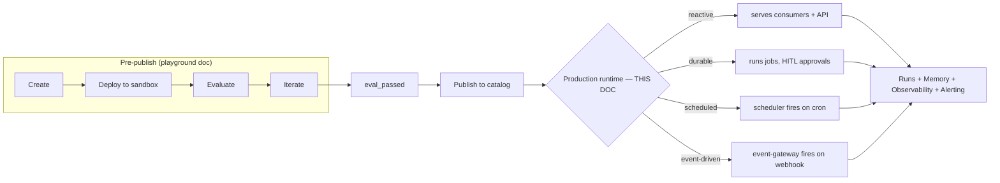
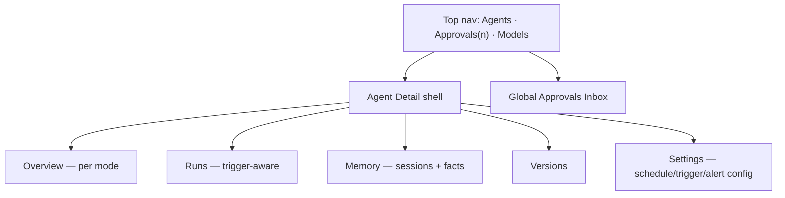
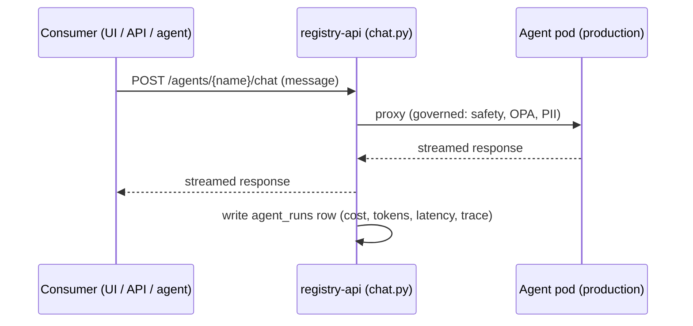
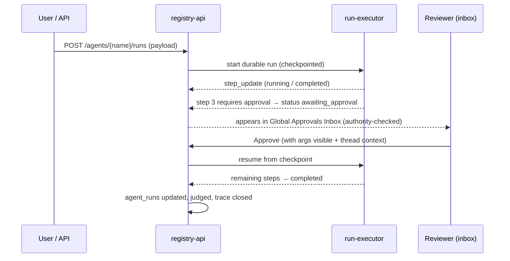
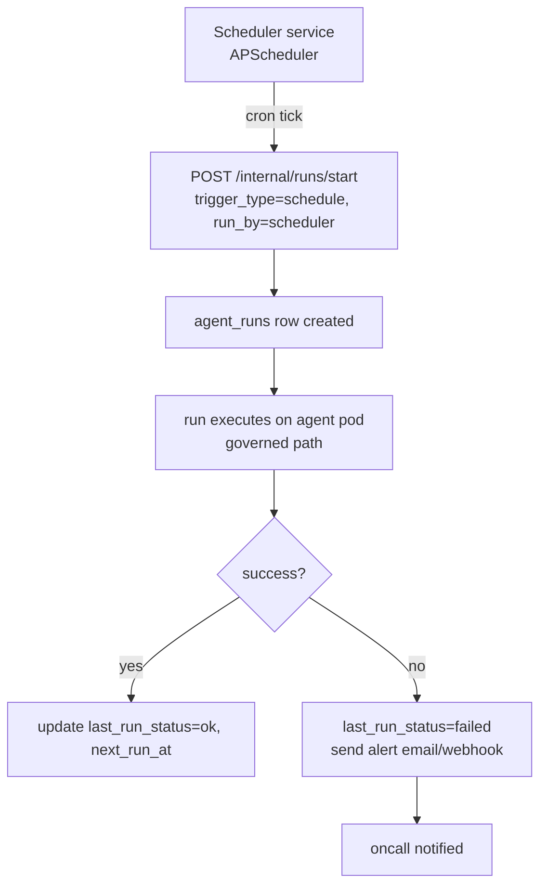
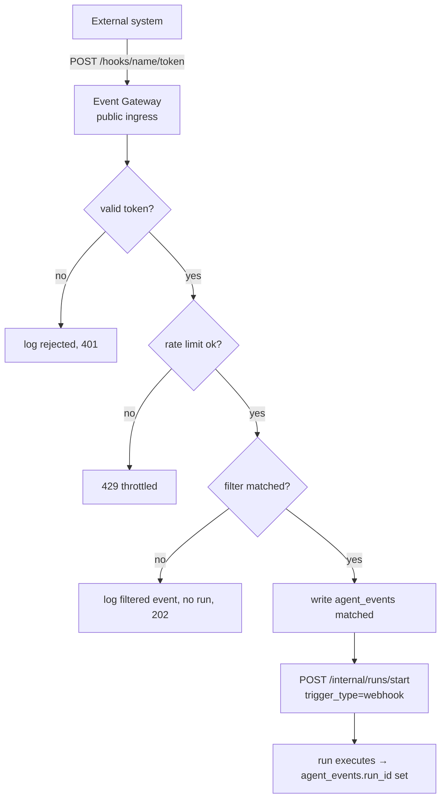
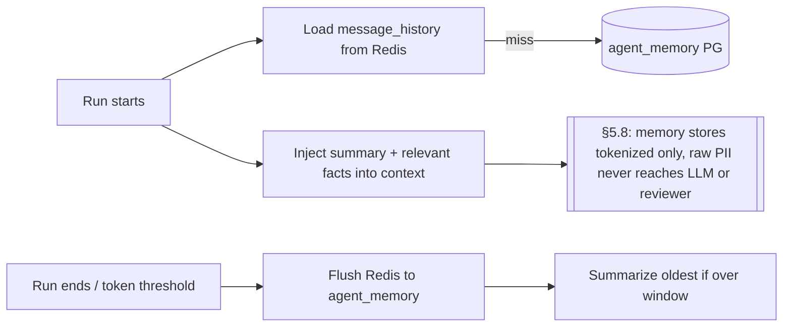
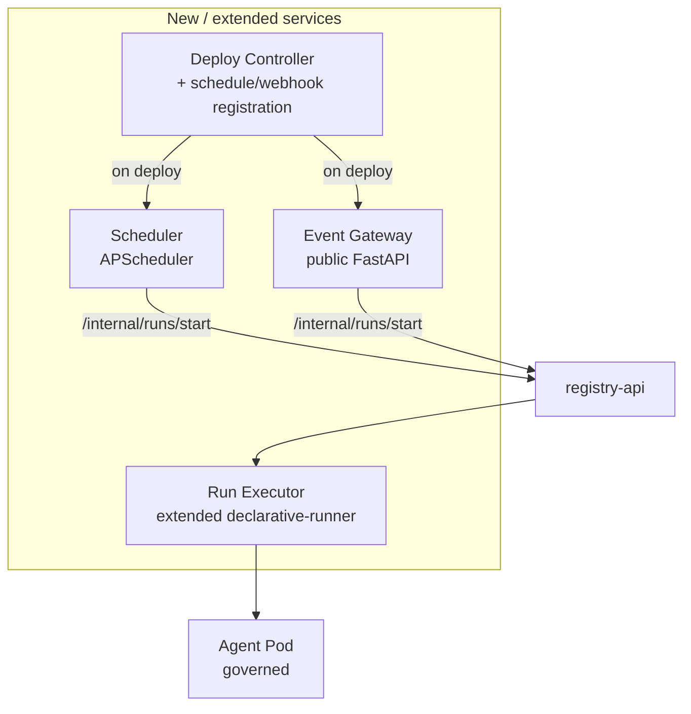
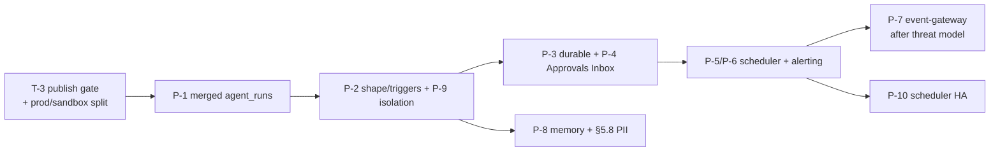

# Production Runtime Design — Agent Execution Modes (post-publish)

**Status:** DRAFT for review — not yet implemented
**Date:** 2026-07-03
**Author:** Karthik + Claude
**Related:** `docs/design/execution-models-and-memory.md` (backend spec), `docs/design/playground-execution-modes.md` (the pre-publish half), `docs/decisions.md` Decisions 20–21

---

## 1. Purpose & Scope

The playground design covers **create + evaluate before publish**. This document covers the other half: **how a published agent behaves in production** — running for real, for real consumers, unattended. It focuses on the **operational experience** (day-2: monitoring, approvals, event logs, schedule health, alerting, failure recovery) and the **UX of the Agent Detail page** per mode. The backend data model / migrations live in the execution-models spec; this doc references them rather than repeating them.

> Playground = *is this agent good enough to publish?* Production = *the agent is live — keep it running, watched, and governed.*

### Where production sits in the lifecycle



What production **adds** over the playground:
- **Automatic firing** — cron ticks, real webhooks land, no human in the loop to start a run.
- **Real consumers** — reactive agents serve users/API/other agents, not a test chat.
- **Real reviewers** — durable approvals go to a Global Approvals Inbox with authority checks (not sandbox self-approval).
- **Day-2 operations** — health, alerting on failure, cancel/pause, restart recovery, webhook security.
- **Memory that persists** across real sessions (governed by the §5.8 PII rule).

---

## 2. Design Principles

1. **The run is the universal record.** Every production invocation — reactive call, durable job, cron fire, webhook — is one row in the merged `agent_runs` (Decision 21), carrying both orchestration (`trigger_type`, `thread_id`, `status`, `run_by`, `team`) and observability (cost, tokens, latency, `langfuse_trace_id`).
2. **Same governed path, non-negotiable.** Production runs go through the safety proxy, per-tool OPA, HITL, and session-scoped PII — identically to the playground. Nothing about "it's production now" relaxes governance.
3. **Mode-appropriate operational surface.** The health signal that matters differs: reactive = latency/error rate; durable = runs awaiting approval; scheduled = last-run status + next fire; event-driven = match vs filtered rate. The Overview tab surfaces the *right* signal per mode.
4. **Isolation is enforced, not assumed.** Tenant (`team`), user (`user_id`), and session (`thread_id`) boundaries hold on every runs/memory query. Roles: `agent:user` / `agent:reviewer` / `agent:admin` / `platform:admin`.
5. **Fail loud.** Unattended modes (scheduled, event-driven) alert on failure — a broken weekly report or a webhook that stopped matching must page someone, not fail silently.

---

## 3. Shared Shell — Agent Detail (production)

Every agent gets the same tabbed shell; the **Overview** tab content varies by mode. The **Global Approvals Inbox** lives in the top nav with a badge (durable agents pause anywhere; reviewers need one place).

```
← Agents   fraud-review                                   [● Running]
           durable · webhook · risk-team · claude-sonnet

 [Overview]  [Runs]  [Memory]  [Versions]  [Settings]         Approvals (3)
 ─────────────────────────────────────────────────────────────────────────
 {Overview content varies by execution shape + trigger}
```

- **Tabs on all modes:** Overview, Runs, Memory, Versions, Settings.
- **Overview** differs per mode (§4–§7).
- **Runs** — trigger-aware table (§8).
- **Memory** — sessions + facts + usage (§8, gated on §5.8).
- **Approvals (n)** — global inbox in nav (§8).



---

## 4. Reactive (production)  `(execution_shape = reactive)`

**Mental model:** a deployed function. Real consumers call it — via the consumer chat UI (`AgentChatPage`), the public API, or another agent. No human starts each run; the caller does.

**Operate =** watch latency / error rate / cost, read run history, drill into a bad run's trace.

### Overview wireframe

```
┌ Overview — reactive ─────────────────────────────────────────────────────┐
│  Endpoint     POST /api/v1/agents/support-bot/chat        [Copy] [API ⌄] │
│  Consumers    chat UI · API key · agent-to-agent                          │
│                                                                          │
│  Last 24h     1,204 runs   p50 840ms   p95 2.1s   err 0.4%   $3.12       │
│  ▁▂▃▅▇▅▃▂▁  (runs/hour sparkline)                                        │
│                                                                          │
│  Recent runs                                                             │
│   14:22  ok    720ms   $0.002   user:alice   [trace]                     │
│   14:21  ok    910ms   $0.003   api:key-7    [trace]                     │
│   14:20  err   —       —        user:bob     [trace]  ⚠ safety_blocked   │
└──────────────────────────────────────────────────────────────────────────┘
```

### Flow



**Entry points (PQ-1 → both):** a reactive agent exposes **both** a consumer **chat page** (`AgentChatPage`, the platform-native surface) *and* a documented **public API endpoint** so other applications embed the agent into their own UX. Both are first-class; the Overview surfaces both (Copy URL + API docs).

**Ops notes:** no approval UI (reactive tool calls still go through OPA inline). The health signal is latency + error rate. Errors surface the reason (e.g., `safety_blocked`, `opa_denied`).

**Status:** ⚠ Partial — consumer chat exists (`AgentChatPage`, `chat.py`, suite-14); the reactive **Overview** metrics panel + `agent_runs`-backed history is not built.

---

## 5. Durable / Long-Running (production)  `(execution_shape = durable)`

**Mental model:** real multi-step jobs that pause for **real** human approval and survive pod restarts. Reviewers act from a global inbox with authority checks (not sandbox self-approval).

**Operate =** launch/monitor active runs, review pending approvals across all agents, cancel/pause, recover from failures.

### Overview wireframe (active runs) + Run Detail

```
┌ Overview — durable ──────────────────────────────────────────────────────┐
│  Active runs                                              [ + New Run ]   │
│   Run #91  ● step 3/5  File JIRA        awaiting approval   4m   [open]   │
│   Run #90  ● step 2/4  Extract clauses  running            1m   [open]   │
│   Run #88  ✓ completed                                    12m   [open]   │
│                                                                          │
│  Awaiting approval: 2   ·   Failed (24h): 1   ·   Avg duration: 6m       │
└──────────────────────────────────────────────────────────────────────────┘

┌ Run #91 ────────────────────────────────────────────────────────────────┐
│  STEPS                       │  Step 3 — File JIRA ticket                │
│  ✓ 1 Parse doc       0.8s    │  ⚠ Awaiting approval · SLA 2h (1h left)   │
│  ✓ 2 Extract clauses 1.2s    │  tool: jira_create   risk: HIGH           │
│  ● 3 File JIRA  ⚠ approval   │  args: { project: LEG, summary: … }       │
│  ○ 4 Notify owner            │  reviewer: you (agent:reviewer)           │
│  ○ 5 Close                   │  [ Approve ] [ Deny ] [ Edit & Approve ]  │
│                              │  ── conversation that led here (memory) ──│
└──────────────────────────────────────────────────────────────────────────┘
```

### Flow



### Ops notes
- **Real authority check** — reviewer must hold `agent:reviewer` for the team (unlike sandbox self-approval).
- **Approval context from memory (anonymized)** — the inbox shows the **anonymized** conversation that led to the approval (`agent_memory WHERE thread_id = approval.thread_id`); PII stays tokenized and is never shown to the reviewer (OQ-3). Reviewers decide from context + tool args, never raw personal data.
- **Approval SLA / timeout** — a run left `awaiting_approval` past its TTL (a **configurable per-agent setting** with a platform default — OQ-10) auto-cancels or escalates (reuses `approval_timeout_worker.py`).
- **Restart recovery** — durable state is checkpointed; a pod restart resumes mid-run, doesn't lose progress.

**Status:** 🔲 Not built. Needs: `run_steps`, run-executor extension, SSE step/approval events, Global Approvals Inbox (spec Phase 3b).

---

## 6. Scheduled (production)  `(trigger = schedule)`

**Mental model:** a recurring job the scheduler fires automatically. You need to know *immediately* when it breaks.

**Operate =** confirm it's firing (last run ok, next fire soon), get alerted on failure, enable/disable without deleting.

### Overview wireframe

```
┌ Overview — scheduled ────────────────────────────────────────────────────┐
│  Schedule    0 9 * * 1   "Every Monday 09:00 UTC"      [enabled ✓] [Edit] │
│  Next fires  Mon Jul 6 · Mon Jul 13 · Mon Jul 20                          │
│  Last run    Mon Jun 29 09:00   ✓ completed   4.2s      [trace]           │
│  Alert       ✉ oncall@acme.com  on failure                    [Edit]      │
│                                                                          │
│  Run history                                                            │
│   Jun 29 09:00  ✓ completed   4.2s   [trace]                             │
│   Jun 22 09:00  ✗ FAILED      —      [trace]  ⚠ tool timeout  (alerted)  │
│   Jun 15 09:00  ✓ completed   3.9s   [trace]                             │
└──────────────────────────────────────────────────────────────────────────┘
```

### Flow



### Ops notes
- **Scheduler fires via `/internal/runs/start`** (cluster-internal, not public).
- **Alerting on failure** is first-class — **email at launch** (PQ-2), configured on the schedule card, not buried in settings. Richer transports (Slack / webhook / PagerDuty) are a future improvement (§14).
- **Enable/disable** without deleting the schedule.
- **Scheduler HA** (OQ-9 → resolved) — **2 replicas** with a distributed lock (Postgres advisory / Redis SETNX); exactly one replica fires each tick, no missed fires on a single-pod crash.

**Status:** 🔲 Not built. Needs: `agent_schedules`, `schedules.py`, `services/scheduler/`, alerting (spec Phase 3d + our resequenced order).

---

## 7. Event-Driven (production)  `(trigger = webhook)`

**Mental model:** a public listener. A real external system POSTs an event; the event-gateway validates, filters, and fires a run. This is the **biggest new attack surface** in the platform.

**Operate =** confirm it's listening, watch matched vs filtered events, rotate the token, tune filters, and keep the endpoint safe.

### Overview wireframe

```
┌ Overview — event-driven ─────────────────────────────────────────────────┐
│  Webhook     POST /hooks/fraud-review/••••••••        ● Listening         │
│              [Copy URL]  [Rotate token]                                    │
│  Filter      event_type == "payment.fail"   [Edit]                        │
│  Last event  2m ago   ✓ matched → run #5                                  │
│                                                                          │
│  Event log                        (matched: 41 · filtered: 12 · 24h)     │
│   14:30  ✓ matched   payment.fail   → run #5   judge 0.90   [trace]       │
│   14:22  ⤫ filtered  payment.ok     (event_type != payment.fail)         │
│   14:05  ✓ matched   payment.fail   → run #4                 [trace]      │
│   13:40  ⚠ rejected  (bad token)                            [details]     │
└──────────────────────────────────────────────────────────────────────────┘
```

### Flow



### Security notes (production-critical)
- **Token** — `sha256(token) == stored_hash`; **manually rotatable** from the Overview (PQ-3). Automatic expiry/rotation is a future improvement (§14).
- **Rate limiting + replay protection** — the gateway must throttle and reject replays (not in the original spec — added here as a hard requirement before launch).
- **Payload sanitization** — inbound payloads pass through the safety proxy before entering agent context (untrusted external input).
- **Filtered ≠ dropped** — filtered events are logged with the reason (debugging misconfiguration).

**Status:** 🔲 Not built. Highest-risk phase — needs a threat model first, then `agent_triggers`/`agent_events`, `triggers.py`/`events.py`, `services/event-gateway/` + Ingress (spec Phase 3e; last in our resequenced order).

---

> **Workflows (composite executables) — same operate surface, agent-tree zoom.** A **Workflow** (a collection of agents working together — backend spec §2.6 / §4.5) is operated **exactly like an agent**: its triggers fire it (cron / webhook / manual / api), it produces runs, appears in the Runs tab, alerts on failure, and its inter-agent approvals land in the same Global Approvals Inbox. The *only* delta: runs are **trees** (parent workflow run → child agent runs via `agent_runs.parent_run_id`), so Run Detail, the Runs tab, and observability **zoom to agent-tree granularity** — expand a workflow run to see which member agent did what. Same tables, same surfaces, same mode/health signals. **No parallel operate stack.**

---

## 8. Cross-Cutting Production Surfaces

### 8.1 Global Approvals Inbox
One nav-level inbox with a badge count of pending approvals **across all agents** for teams the reviewer manages. Authority-checked (`agent:reviewer`). Each item shows tool + risk + args + the **anonymized** memory thread that led to it (PII tokenized, never shown — OQ-3). This is the single most important durable-mode surface — approvals must not be hunted per-agent.

### 8.2 Runs surface (trigger-aware)
Every mode writes to `agent_runs`. The Runs tab is a filterable table showing `trigger_type` (manual/api/schedule/webhook), status, duration, cost, `run_by`, and trace link. Non-admins see only their own runs (`user_id`); reviewers/admins see the team's.

### 8.3 Memory (production)

Hot path (Redis) + cold path (pgvector semantic search). **The §5.8 PII rule is mandatory:** memory writes pass the safety proxy; `agent_memory` stores **tokenized** content only — raw PII lives solely in the session `pii_mappings` and is applied at the output boundary to the end user; the LLM, agents, reviewers, and stored memory never see raw PII (OQ-3). Memory tab: sessions + facts + usage.

### 8.4 Observability per mode
| Mode | Primary health signal | Alert on |
|---|---|---|
| reactive | p95 latency, error rate | error-rate spike |
| durable | runs awaiting approval, failed runs | approval SLA breach, run failure |
| scheduled | last-run status, next-fire | missed/failed fire |
| event-driven | match rate, rejected count | webhook failures, token-rejection spike |

### 8.5 Multi-tenancy & roles
`team` column on all run/memory tables (belt-and-suspenders); `thread_id = {team}:{agent}:{user_id}:{uuid}`; roles `agent:user` / `agent:reviewer` / `agent:admin` / `platform:admin` (spec §5). Application-layer enforcement in registry-api on every runs/memory endpoint.

---

## 9. Services (production infra)



- **Scheduler** (`services/scheduler/`) — reads `agent_schedules`, fires via `/internal/runs/start`.
- **Event Gateway** (`services/event-gateway/`) — public `/hooks/*`, validates + filters + dispatches.
- **Run Executor** — extends `declarative-runner` to write `run_steps`, pause on approvals, load/save memory.
- **Deploy Controller** — on publish/deploy, registers schedules and webhooks, returns the generated URL.

---

## 10. Data Model Touchpoints (production)

| Table | Role | Change |
|---|---|---|
| `agent_runs` | universal run spine (all modes) | **merge** orchestration fields into existing observability table (Decision 21) |
| `run_steps` | durable step log | **new**; shared with playground StepTracker |
| `agent_schedules` | cron config | **new**; scheduler reads |
| `agent_triggers` / `agent_events` | webhook config + inbound log | **new**; event-gateway writes |
| `agent_memory` | history/facts/knowledge + embeddings | **new**; pgvector; §5.8 PII rule |
| `agents` | `execution_shape` + `memory_enabled` | **new columns** (Decision 21) |

---

## 11. TODO Items Folded In

Production-scope work. `P-*` are production items; shared `T-*` come from the playground doc / decisions.

| ID | Item | Depends |
|---|---|---|
| **P-1** | Merge `agent_runs` (Decision 21) — the run spine every mode writes to | — |
| **P-2** | `execution_shape` + `memory_enabled` on agents; triggers table | P-1 |
| **P-3** | `run_steps` + run-executor (durable steps, pause on approval, restart recovery) | P-1 |
| **P-4** | Global Approvals Inbox (nav badge, authority-checked, memory context) | P-3 |
| **P-5** | Scheduler service + `agent_schedules` + `/internal/runs/start` | P-1 |
| **P-6** | Alerting on scheduled/event failure — **email at launch** (Slack/webhook/PagerDuty = future, §14) | P-5 |
| **P-7** | Event Gateway + `agent_triggers`/`agent_events` + **threat model** (rate limit, replay, payload sanitization); token rotation **manual** at launch (auto = future, §14) | P-1 |
| **P-8** | Memory: `agent_memory` + Redis + pgvector + **§5.8 PII rule** | P-1 |
| **P-9** | Multi-tenancy: `team` columns, `thread_id` format, roles `agent:user/reviewer/admin` | P-1 |
| **P-10** | Scheduler HA — **2 replicas + distributed lock** (OQ-9 resolved) | P-5 |
| **P-11** | System principal — **service-account name** as `run_by` (OQ-1; richer managed identity = future, §14 FI-3) | P-5, P-7 |
| **T-3** | Eval gate at **publish** (Decision 20) — the boundary into production | shared |
| **T-10** | `environment=production` vs `sandbox` deploys distinct (pairs with sandbox from playground doc) | shared |

Shared with the playground doc: `run_steps` + StepTracker (P-3 ↔ playground T-6), and the publish gate (T-3) is the seam between the two docs.

---

## 12. Open Questions (production)

Several spec OQs were **resolved 2026-07-03** (recorded in `docs/design/execution-models-and-memory.md` §10):
- **OQ-1 → service-account name** as the system principal (`run_by`); richer managed identity = future (§14 FI-3).
- **OQ-3 → anonymized** reviewer view — PII never shown to reviewer / LLM / agents (sharpens §5.8: memory stores tokenized form only).
- **OQ-9 → 2 replicas + distributed lock** (scheduler HA).
- **OQ-10 → configurable** run-timeout setting (per-agent + platform default).

Resolved here (2026-07-03):
- **PQ-1 → Both.** Reactive agents get **both** a consumer **chat page** (`AgentChatPage`) *and* a documented **public API endpoint** other applications integrate into their own UX. Neither is primary — both are first-class production entry points.
- **PQ-2 → Email first.** Failure alerting ships with **email** at launch (P-6). Richer transports (Slack / generic webhook / PagerDuty) are recorded as a **future improvement** (§14).
- **PQ-3 → Manual rotation first.** Webhook token rotation is **manual** (button on the Overview) at launch (P-7). Automatic expiry/rotation is recorded as a **future improvement** (§14).

---

## 13. Build Sequence (production scope)



| Phase | Delivers | Depends |
|---|---|---|
| **PR-0** | Publish gate + prod/sandbox deploy split | Decision 20 |
| **PR-1** | Merged `agent_runs` spine + shape/trigger columns + isolation | PR-0 |
| **PR-2** | Durable runtime + Global Approvals Inbox | PR-1, run-executor |
| **PR-3** | Memory (hot/cold) under the §5.8 PII rule | PR-1 |
| **PR-4** | Scheduler + failure alerting | PR-1 |
| **PR-5** | Event gateway — **only after the threat model** | PR-4 |
| **PR-6** | Scheduler HA + system-principal audit | PR-4 |

Ordering mirrors the resequenced execution-models build: durable + approvals early (reuses HITL), memory after the PII rule, **event-driven last** (biggest attack surface).

---

## 14. Future Improvements

Recorded per the decisions above — ship the simple version first, evolve later.

| # | Area | Launch (v1) | Ideal / future |
|---|---|---|---|
| FI-1 | **Alerting transport** (PQ-2, P-6) | Email on scheduled/event failure | Multi-channel: Slack, generic webhook, PagerDuty; per-agent routing + severity; digest vs per-event |
| FI-2 | **Webhook token rotation** (PQ-3, P-7) | Manual "Rotate token" button on Overview | Automatic expiry + scheduled rotation; dual-token overlap window (old + new valid during cutover) to avoid dropped events; per-source tokens |
| FI-3 | **System-run identity** (OQ-1, P-11) | Service-account name string as `run_by` (e.g. `serviceaccount:scheduler`, `serviceaccount:webhook:{trigger_id}`) | Dedicated managed Keycloak service principal per system component with scoped RBAC + full audit trail; per-trigger identities |

Both follow the same principle: **implement the simple path now, record the ideal as a future improvement** so it isn't lost. Other future work already tracked elsewhere: scheduler HA (spec OQ-9), system-principal audit (spec OQ-1), semantic-memory embedding source (spec OQ-5), data residency / schema-per-tenant (spec OQ-4).

---

## Appendix — Production vs Playground (same modes, different surface)

| Mode | Playground (evaluate) | Production (operate) |
|---|---|---|
| reactive | test chat, judge | serve consumers + API; latency/cost monitoring |
| durable | test run, **self-approve**, args shown | real runs, **authority-checked** Global Approvals Inbox |
| scheduled | **Run Now** test-fire (no cron) | scheduler fires on cron; alert on failure |
| event-driven | **Test Trigger** synthetic payload | public webhook; token/rate-limit/replay security |
| memory | evaluated per session | persists cross-session under §5.8 PII rule |
| approvals | self-approve (sandbox) | reviewer authority + SLA/timeout |
| **workflow** (composite) | test-fire, judged; StepTracker shows agent-tree | triggers fire it; run tree in Runs/observability; inter-agent approvals in Global Inbox |
