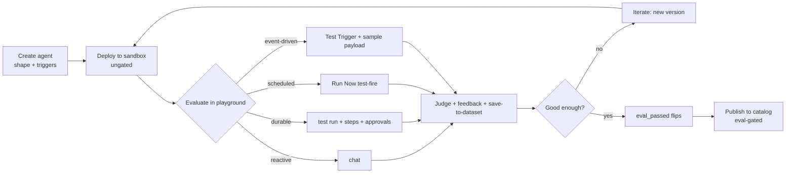
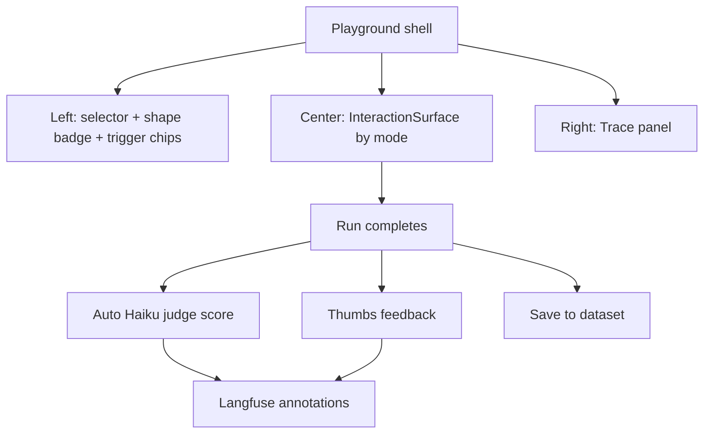
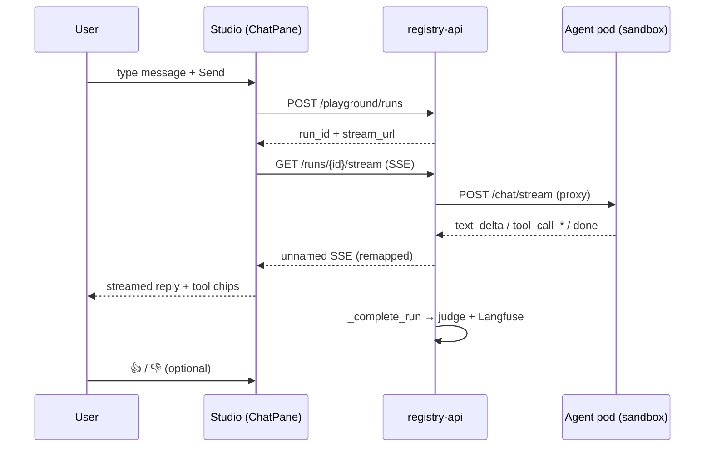
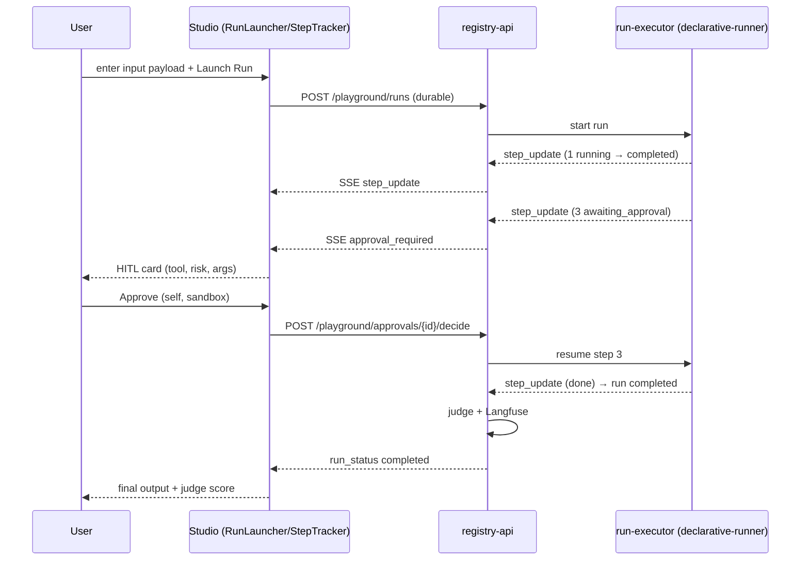
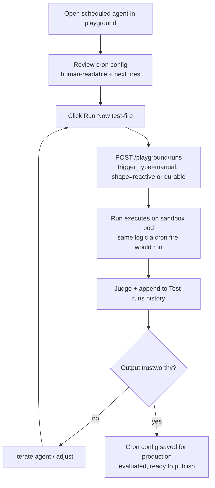
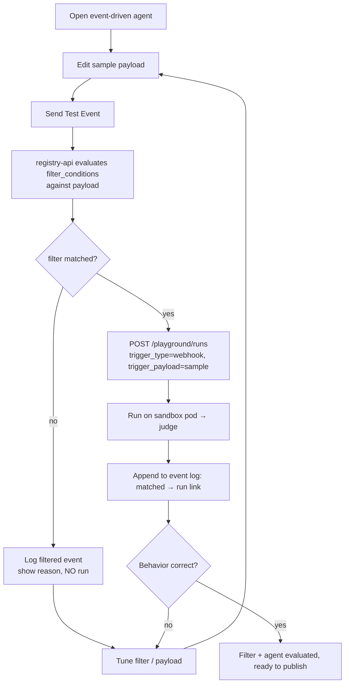
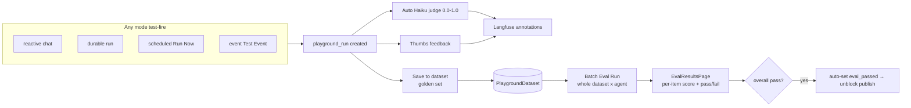
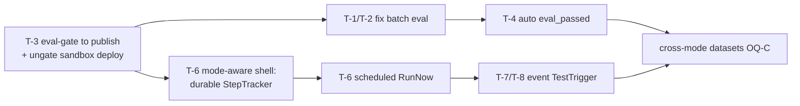

# Playground Design — Evaluating Agents Across Execution Models

**Status:** DRAFT for review — not yet implemented
**Date:** 2026-07-02
**Author:** Karthik + Claude
**Related:** `docs/design/execution-models-and-memory.md` (the models), `docs/experience/playground.md` (today's reactive-only playground), `docs/decisions.md` Decisions 20–21

---

## 1. Purpose & Scope

This document designs the **playground / evaluation surface** for all four execution modes. It is deliberately scoped to *pre-publish* — how a developer **creates and evaluates** a reactive, durable, scheduled, or event-driven agent in the sandbox before it is allowed into the catalog. Production runtime (cron actually firing, live webhooks arriving, the scheduler + event-gateway services) is covered by the execution-models spec and is **out of scope here**.

The one-line framing:

> The playground is where **every mode is test-fired and judged before publish**. Production is where triggers fire on their own.

### Where the playground sits in the lifecycle (Decision 20)



The playground is the **Evaluate** box. It must adapt its interaction surface to the agent's `execution_shape` and `triggers` — it can no longer be a chat pane only.

---

## 2. Design Principles

1. **One shell, a mode-aware interaction surface.** The 3-panel playground shell stays; only the *center panel* (today the ChatPane) swaps by mode. Left = selector + config summary, Right = trace panel, overlay = HITL. Consistent muscle memory across modes.
2. **Evaluate on the real code path.** Every test-fire goes through the same governed path as production — safety proxy, per-tool OPA, HITL, session-scoped PII. A "Test Trigger" sends a synthetic payload through the *same* handler a real webhook would hit. No mocked shortcuts, or the evaluation is worthless.
3. **Every evaluation produces a judged, save-able run.** Regardless of mode, a test-fire creates a `playground_run`, gets an automatic LLM-as-Judge score, accepts thumbs feedback, and can be pinned to a dataset. This is the unit of evaluation.
4. **Sandbox isolation.** Evaluation runs against a dedicated **`environment=sandbox`** deployment (distinct from production/staging/canary — OQ-D). All runs are `sandbox=true`, `context=playground`; no production state touched; purple "Sandbox mode" badge always visible. Approvals self-approve (no authority check) but the developer **must review the args on every one** (OQ-E). Runs **auto-cancel after a wall-clock TTL** (default 10 min, configurable — OQ-A) so a stuck durable run can't hang the sandbox.
5. **Test-fire, never wait.** Scheduled agents are not left to tick; event-driven agents are not wired to public ingress. In the playground you fire them *manually / synthetically* and inspect the result immediately.

---

## 3. Shared Shell — Information Architecture

The shell is constant; the center panel is a `<InteractionSurface>` that renders by mode.

```
┌───────────────────┬───────────────────────────────────────┬──────────────┐
│  LEFT (240px)     │  CENTER  — <InteractionSurface>        │  RIGHT       │
│                   │  swaps by execution_shape + trigger:   │  Trace panel │
│  Agent selector   │                                        │  (event log, │
│  Shape badge      │   reactive   → ChatPane                │  collapsible)│
│  Trigger chips    │   durable    → RunLauncher+StepTracker │              │
│  Sandbox badge    │   scheduled  → RunNowPanel+History     │              │
│  → Datasets/Eval  │   event      → TestTriggerPanel+Log    │              │
└───────────────────┴───────────────────────────────────────┴──────────────┘
                                    ↓ (on approval_requested, durable only)
                          ┌──────────────────────────────┐
                          │  HITL overlay (HitlPanel)    │
                          │  tool · risk · args          │
                          │  Approve / Deny (self)       │
                          └──────────────────────────────┘
```

**Constant across every mode** (the right rail + footer):
- **Trace panel** — event log with per-event timestamps; "View Trace" → Langfuse span tree.
- **Judge chip** — the automatic 0.0–1.0 Haiku score once the run completes.
- **Feedback bar** — 👍 / 👎 → Langfuse `user-feedback` annotation.
- **Save to dataset** — pin the run's input (and, once fixed, output) to a golden set.



---

## 4. Reactive  `(execution_shape = reactive)`

**Mental model:** a function. Send input → streamed response. This is the playground that exists today.

**Evaluate =** chat with the agent, watch it stream, judge the reply.

### Wireframe

```
┌ smoke-agent  [sandbox] ────────────────────────────────────────────────┐
│                                                                          │
│   ┌ user ─────────────────────────────┐                                 │
│   │ What's the status of order 123?   │                                 │
│   └───────────────────────────────────┘                                 │
│                          ┌ assistant ───────────────────────────────┐   │
│                          │ [Calling get_order…] → [get_order: ok]    │   │
│                          │ Order 123 shipped on the 30th, arriving…  │   │
│                          └───────────────────────────────────────────┘   │
│                                                                          │
│   Judge: 0.92 ✓   👍 👎   [View Trace]                                   │
├──────────────────────────────────────────────────────────────────────────┤
│  Message smoke-agent…                                          [ Send ▷ ] │
└──────────────────────────────────────────────────────────────────────────┘
```

### User flow



**Status:** ✅ Built (see `docs/experience/playground.md`). Nothing new for reactive except it becomes one branch of `<InteractionSurface>`.

---

## 5. Durable / Long-Running  `(execution_shape = durable)`

**Mental model:** a job with named steps that may pause for human approval. You evaluate it by launching a test run and watching the steps proceed, approving/denying at checkpoints.

**Evaluate =** launch a run with an input payload → watch the step list fill in → approve/deny HITL steps inline → judge the final output.

### Wireframe — split: step list (left of center) + interaction (right of center)

```
┌ contract-review  [sandbox · durable] ───────────────────────────────────┐
│  Input: {"contract_url": "s3://demo/acme.pdf"}          [ ▶ Launch Run ] │
├────────────────────────── Run #7 · running ─────────────────────────────┤
│  STEPS                          │  DETAIL / INTERACTION                   │
│  ✓ 1 Parse document      812ms  │                                        │
│  ✓ 2 Extract clauses    1.2s    │   Step 3 — File JIRA ticket            │
│  ● 3 File JIRA ticket   …       │   ⚠ Awaiting approval                  │
│  ○ 4 Notify owner               │                                        │
│                                 │   tool: jira_create   risk: HIGH       │
│                                 │   args: { project: "LEG",              │
│                                 │           summary: "Review Acme MSA" } │
│                                 │                                        │
│                                 │   [ Approve ]  [ Deny ]  [ Edit&Appr ] │
├──────────────────────────────────────────────────────────────────────────┤
│  Judge: —  (pending run completion)              [View Trace]            │
└──────────────────────────────────────────────────────────────────────────┘
```

Legend: `✓` completed · `●` running · `○` pending · `⚠` awaiting approval.

### User flow



### Playground-specific notes
- **Self-approval, args always shown (OQ-E):** in `context=playground` the HITL card approves without an authority check, but the full tool args are shown on **every** approval — with any PII tokenized (OQ-3: raw PII is never shown to the developer-reviewer either). One-click auto-approve is intentionally not offered, because inspecting the args is the evaluation.
- **Auto-cancel (OQ-A):** a durable run exceeding the sandbox TTL (default 10 min) or left `awaiting_approval` past the limit is auto-cancelled → `status=cancelled`. Reuses the `approval_timeout_worker.py` pattern.
- **Step semantics** come from `run_steps` (new table). The playground reads the same stream a production run emits (`step_update`, `approval_required`) — one StepTracker component, reused (OQ-B, to revisit).
- **Judge** scores the *final* output; per-step judging is out of scope for v1.

**Status:** 🔲 Not built. Depends on: `run_steps` table, `run_steps.py` router, run-executor extension, SSE step/approval events (execution-models spec Phase 3b).

---

## 6. Scheduled  `(trigger = schedule)`

**Mental model:** a recurring job. In the playground you do **not** wait for the cron — you configure the schedule (for later, in production) and **test-fire it now** to evaluate what one run produces.

**Evaluate =** review/parse the cron config → click **Run Now** → a single run executes immediately (reactive or durable inside, per the agent's shape) → judge it. Repeat until the output is trustworthy enough to run unattended.

### Wireframe

```
┌ weekly-compliance  [sandbox · scheduled] ───────────────────────────────┐
│  SCHEDULE (applies in production)                                        │
│   cron:  0 9 * * 1        →  "Every Monday at 09:00 UTC"                 │
│   next 3 (prod):  Mon Jul 6 · Mon Jul 13 · Mon Jul 20    [enabled ✓]     │
│                                                                          │
│   ⓘ In the playground the schedule does NOT fire. Test it manually:      │
│                                              [ ▶ Run Now (test-fire) ]   │
├───────────────────────── Test runs ─────────────────────────────────────┤
│   #3  just now   completed   judge 0.88 ✓   2.4s   [View] [Save]         │
│   #2  4m ago     completed   judge 0.71     3.1s   [View] [Save]         │
│   #1  9m ago     failed      —              —       [View]                │
└──────────────────────────────────────────────────────────────────────────┘
```

### User flow



### Playground-specific notes
- **Cron is configured but inert here.** The playground shows next-fire times as *production* previews and never ticks. A banner makes this explicit.
- **Run Now** issues a normal `playground_run` with `trigger_type=manual` — identical execution to a real scheduled fire, minus the timer.
- **Test-runs history** is just the mode-appropriate framing of the run list, filtered to this agent.

**Status:** 🔲 Not built. Needs: schedule config card (read/preview in playground), a **Run Now** action (reuses `POST /playground/runs`), test-run history list.

---

## 7. Event-Driven  `(trigger = webhook)`

**Mental model:** a listener. In production a real webhook fires it. In the playground you **send a sample payload through the exact same handler** — the spec's "Test Trigger, same code path as production" — and evaluate the resulting run, including filter matching.

**Evaluate =** author a sample event payload → send it → see whether the filter *matched* or *filtered out* → if matched, inspect the run + judge → tune filter conditions until behavior is right.

### Wireframe

```
┌ fraud-review  [sandbox · event-driven] ─────────────────────────────────┐
│  TRIGGER (webhook)                                                       │
│   filter:  event_type == "payment.fail"   [+ Add condition]             │
│   prod URL: /hooks/fraud-review/•••••  (generated on publish)           │
│                                                                          │
│  SAMPLE PAYLOAD                          [ ▶ Send Test Event ]           │
│   ┌────────────────────────────────────────────────────────────────┐    │
│   │ { "event_type": "payment.fail",                                 │    │
│   │   "amount": 12000, "card": "•••4242" }                          │    │
│   └────────────────────────────────────────────────────────────────┘    │
├───────────────────────── Event log ─────────────────────────────────────┤
│   just now   ✓ matched     → run #5   judge 0.90 ✓   [View] [Save]       │
│   2m ago     ⤫ filtered    (event_type != payment.fail)   [View]        │
│   5m ago     ✓ matched     → run #4   judge 0.62        [View] [Save]    │
└──────────────────────────────────────────────────────────────────────────┘
```

Legend: `✓ matched` → ran the agent · `⤫ filtered` → logged, no run (critical for debugging filters).

### User flow



### Playground-specific notes
- **No public ingress in the playground.** The Send Test Event button posts the payload internally to the *same filter+run code path* the production event-gateway would use. The generated `/hooks/...` URL is shown as a production preview only.
- **Filtered events are logged, not silently dropped** — the whole point is to debug misconfigured filters before going live.
- **Matched events** create a normal `playground_run` with `trigger_type=webhook` and the sample as `trigger_payload`.

**Status:** 🔲 Not built. Needs: trigger/filter config panel, sample-payload editor, an internal "test event" endpoint that runs the real filter logic, event log list.

---

> **Workflows (composite executables) — same surface, one extra zoom.** A **Workflow** (a collection of agents working together — backend spec §2.6 / §4.5) is evaluated here **exactly like an agent**: select it, test-fire it per its trigger + shape, watch it stream, judge the result, save to a dataset, batch-eval. The *only* delta: a workflow produces a **run tree** (parent workflow run → child agent runs), so the durable **StepTracker shows agent-level steps** — which member agent ran, hand-offs, status — and you expand any step to drop into that child agent's own internal steps. Same component, same SSE stream, one added zoom level. Inter-agent approvals use the same HITL card. **There is no separate playground surface for workflows.**

---

## 8. Cross-Cutting — Evaluation, Judge, Datasets, Batch Eval

Every mode funnels into the same evaluation machinery. This is what makes "evaluate before publish" meaningful.



- **Interactive judge** (per run) already exists for reactive; it applies unchanged to every mode's test-fire.
- **Batch eval** runs a whole dataset through the agent. Today it is **blocked** (see TODO T-1) and scores by keyword match, not the judge (TODO T-2).
- **The eval → publish wire** (auto-set `eval_passed` from a passing batch eval) does not exist yet (TODO T-4). Until it does, `eval_passed` is a manual/hardcoded rubber stamp.

---

## 9. Data Model Touchpoints (playground scope)

| Table | Role in playground | Change needed |
|---|---|---|
| `deployments` | the **sandbox** pod the playground streams to | **add `sandbox` to the `environment` CHECK** (currently production/staging/canary) — T-10, OQ-D |
| `playground_runs` | one row per test-fire, any mode | add `trigger_type`, `trigger_payload`; already has status/judge fields |
| `run_steps` | durable step list (shared with prod) | **new** (execution-models spec) — playground reads it via SSE |
| `agent_schedules` | cron config shown/previewed | **new**; playground reads (never fires) |
| `agent_triggers` / filter | filter config + sample testing | **new**; playground needs an internal "test event" path |
| `playground_datasets` | golden set from saved runs | exists; store output once `output_text` mapped; **item shape is per-mode, not unified** (OQ-C) |
| `eval_runs` / `eval_run_results` | batch eval | exists; blocked by TODO T-1 |

> Note the relationship to Decision 21: **production** runs use the merged `agent_runs`; **playground** runs stay in `playground_runs` (sandbox scoping). Both share `run_steps` semantics and the same SSE contract, so the durable step viewer is one component reused across playground and production. Per OQ-D, the playground streams to a deployment with **`environment=sandbox`** — a new allowed value in the `deployments.environment` CHECK constraint.

---

## 10. TODO Items Folded In

These are the tracked gaps this design depends on or exposes. IDs map to the memory todos and decisions.

| ID | Item | Blocks | Source |
|---|---|---|---|
| **T-1** | **Batch eval 403** — eval-runner's `X-User-Sub: eval-runner` is rejected by `create_playground_run`; Job crashes, EvalRun stuck at `running`. Fix = service-identity bypass + try/except. | §8 batch eval (all modes) | `todo-batch-eval-403` |
| **T-2** | **Keyword-match vs LLM judge** — eval-runner scores by substring, ignores the Haiku judge it already triggers. | §8 quality of batch scores | `todo-batch-eval-403` |
| **T-3** | **Eval-gate placement** — move `eval_passed` gate from *deploy* to *publish*; deploy-to-sandbox ungated so the playground can even run. | §1 lifecycle; enables sandbox evaluation | Decision 20 / `todo-agent-lifecycle-refactor` |
| **T-4** | **Auto-set `eval_passed`** from a passing batch EvalRun (kill the manual/hardcoded rubber stamp). | §8 eval→publish wire | Decision 20 |
| **T-5** | **Studio deploy label + hardcoded flag** — "Deploy to Production" is a sandbox test deploy; `DeployAgentPage` hardcodes `eval_passed: true`. | §1 lifecycle honesty | `todo-agent-lifecycle-refactor` |
| **T-6** | **Mode-aware `<InteractionSurface>`** — durable RunLauncher+StepTracker, scheduled RunNow, event TestTrigger. Playground is reactive-chat-only today. | §5 §6 §7 | this doc / `docs/experience/playground.md` |
| **T-7** | **Internal "Test Event" endpoint** — runs real `filter_conditions` + run logic against a synthetic payload (no public ingress). | §7 event-driven eval | this doc |
| **T-8** | **`playground_runs.trigger_type` / `trigger_payload`** columns for scheduled/event test-fires. | §6 §7 | this doc |
| **T-9** | **Merge output into save-to-dataset** — dataset items store only `input` today (`output_text` unmapped). | §8 golden sets | `docs/experience/playground.md` |
| **T-10** | **`environment=sandbox`** — add `sandbox` to the `deployments.environment` CHECK constraint; playground streams to the sandbox deployment. | §1 lifecycle, all modes | OQ-D / Decision 20 |
| **T-11** | **Sandbox run TTL / auto-cancel** — cancel durable/awaiting-approval runs past a wall-clock limit (default 10 min, configurable). Reuse `approval_timeout_worker.py`. | §5 durable, OQ-A | OQ-A |

Dependency order (playground scope): **T-3 → T-1/T-2 → T-4** unblock the evaluation loop; **T-10** underpins all modes (sandbox target); **T-6 → T-7/T-8** build the mode surfaces; **T-5, T-9, T-11** are cleanups/guards.

---

## 11. Resolved Decisions (reviewed 2026-07-02)

- **OQ-A → Cap it.** Sandbox runs **auto-cancel after a wall-clock TTL** (proposed default **10 min**, configurable per agent). Reuses the existing `approval_timeout_worker.py` pattern. Applies to durable runs and any run left `awaiting_approval`.
- **OQ-B → Reuse the StepTracker for now.** One StepTracker component for durable runs *and* durable-inner scheduled/event runs. **⏳ Revisit after hands-on testing** — Karthik to give input once he's tried it (tracked in memory `todo-revisit-steptracker`).
- **OQ-C → No unified dataset shape.** Dataset item schemas **may differ per mode** (reactive: `{input, expected_output}`; event/scheduled: `{trigger_payload, expected_output}`). Batch eval interprets items by the agent's mode; do not force one schema.
- **OQ-D → Distinct `environment=sandbox`.** The playground evaluates against a **dedicated `sandbox` deployment**, separate from production/staging/canary. Firms up Decision 20's "introduce a sandbox environment." Requires adding `sandbox` to the `deployments.environment` CHECK constraint (T-10).
- **OQ-E → Always show the args.** **No one-click approve.** The durable HITL card always shows the full tool args on every approval — seeing and judging them *is* the evaluation.

---

## 12. Build Sequence (playground scope)



| Phase | Delivers | Depends |
|---|---|---|
| **PP-0** | Sandbox deploy ungated; eval gate at publish (T-3, T-5) | Decision 20 |
| **PP-1** | Batch eval works + real judge (T-1, T-2) | PP-0 |
| **PP-2** | Durable eval surface — RunLauncher + StepTracker + HITL (T-6) | run_steps + run-executor (spec 3b) |
| **PP-3** | Scheduled eval surface — Run Now + test-run history (T-6, T-8) | PP-2 shell |
| **PP-4** | Event-driven eval surface — Test Trigger + event log (T-6, T-7, T-8) | PP-3 shell |
| **PP-5** | Auto eval→publish wire + cross-mode datasets (T-4, T-9, OQ-C) | PP-1 |

---

## Appendix — Component Map

| Component | Mode(s) | New? | Notes |
|---|---|---|---|
| `ChatPane` | reactive | exists | today's SSE consumer |
| `RunLauncher` | durable, scheduled(RunNow), event(after match) | new | input payload → start run |
| `StepTracker` | durable (+ durable-inner scheduled/event) + **workflows** | new | reads `run_steps` via SSE; reused prod + playground; renders agent-tree zoom for workflow runs |
| `HitlPanel` | durable | exists | self-approve in sandbox |
| `RunNowPanel` | scheduled | new | cron preview + Run Now + test-run history |
| `TestTriggerPanel` | event-driven | new | filter config + sample payload + event log |
| `TracePanel` | all | exists | event log + Langfuse link |
| `JudgeChip` / feedback bar | all | exists | Haiku score + thumbs |
| Datasets / `EvalResultsPage` | all (batch) | exists | blocked by T-1 |
